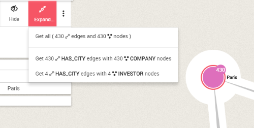
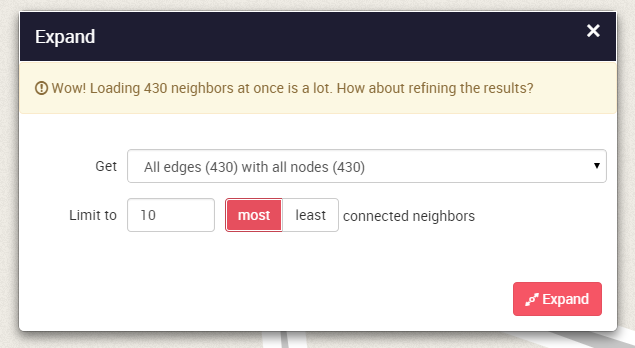

# Expand Nodes

Expand nodes to display their relationships and direct neighbors. We can expand nodes in different ways:

* double-click on a node in the view
* select one or multiple nodes, then click on the ```Expand``` button of the left panel.
* right-click on a node in the view, then click on the ```Expand``` button of the tooltip.

The ```Expand``` buttons display the list of available relationship types and neighbor categories. We can choose to get everything or to filter the retrieved relationships and neighbors.



If the expanded nodes have too many neighbors, it may however lead to unreadable visualization.

Linkurious prevents us to add to many neighbors at once by asking to filter the retrieved neighborhood. A safeguard popup will appear, providing options to select a specific relationship type and neighbor category, to pick the most or least connected neighbors, and to change the maximal number of retrieved neighbors. We may bypass this limit manually.



> It is tempting to always add more nodes and edges to your visualization. Beware though, if you are not careful you may end up with too many nodes on your screen... and a worthless visualization.

> In order to avoid that, remember to always think twice before adding more information to your visualization. The filters and the hide functionality are here to help!
