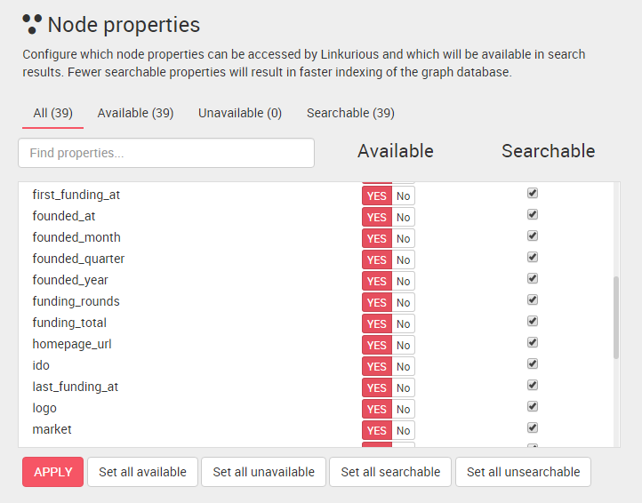

## Search index

Choose which properties of nodes and edges will be used in search results by configuring the index. By default, Linkurious indexes all available properties. Notice that unavailable properties are not indexed and thus cannot be found via the search engine.

  Indexing less data will reduce indexing time.

### Change the list of searchable properties

Open the Data administration dashboard, then scroll down to the **Node properties** section. Check the properties that can be searchable.

Click on the **Apply** button when you are done.

We can do the same for edge properties.

  We must reindex data to apply changes on search results.

