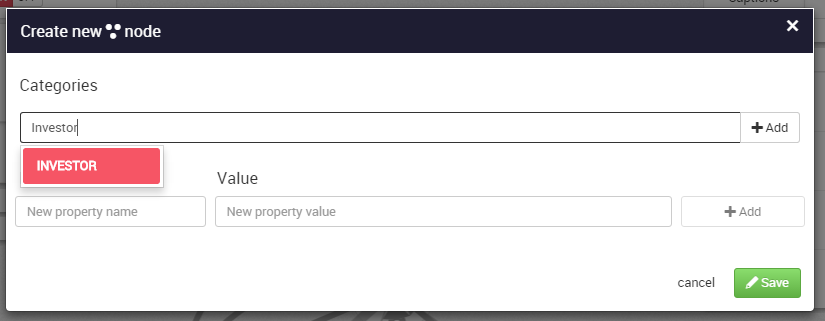
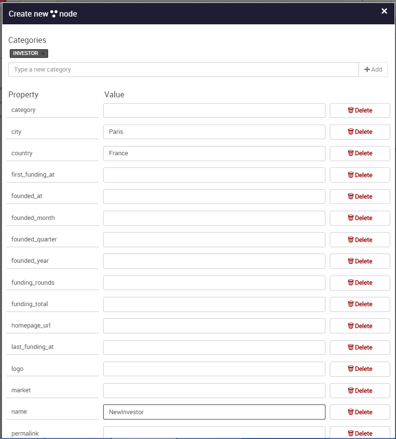
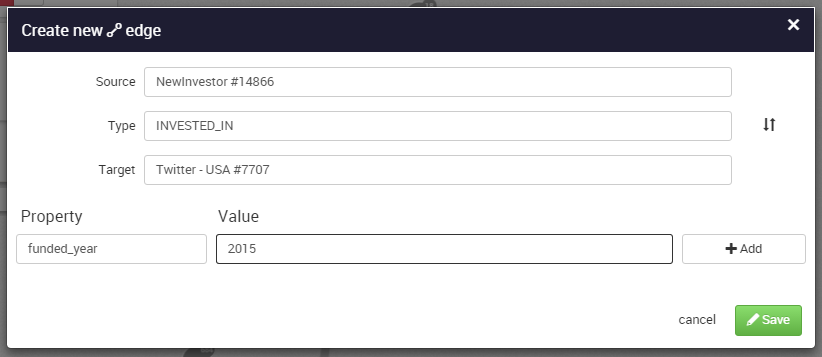

## Create new nodes and edges

On the ```more options``` panel, we can choose to create either a node or an edge


### Create a node

We enter a value for the ```Categories```here Investor and hit add. 



Then for each property we can fill the corresponding value. When it is done, we hit ```Save```.
.



Here we entered the value ```Paris``` for the City property, the value ```France``` for the Country property and the value ```NewInvestor``` for the Name property.


We can see the node created ```NewInvestor``` added to our graph.


### Create an edge

We have to provide the following information :



* ```Type```: the type of relationship;
* ```Source```: the source of the relationship;
* ```Target```: the destination of the relationship.

Like for the nodes, we can add as many properties as we want to the edge. When we are done, we simply click on ```Save```.

Here we entered the value ```Twitter``` for the Source, the value ```INVESTED_IN``` for the Type property and the value ```NewInvestor``` for the Target and finally ```2015``` for the ```funded_year``` property.


Finally, we can see in our graph our new node and our new edge:


It is also possible to create a new edge between two nodes by selecting those two nodes and clicking on ```Create a new edge```. The source and target nodes will be filled.
