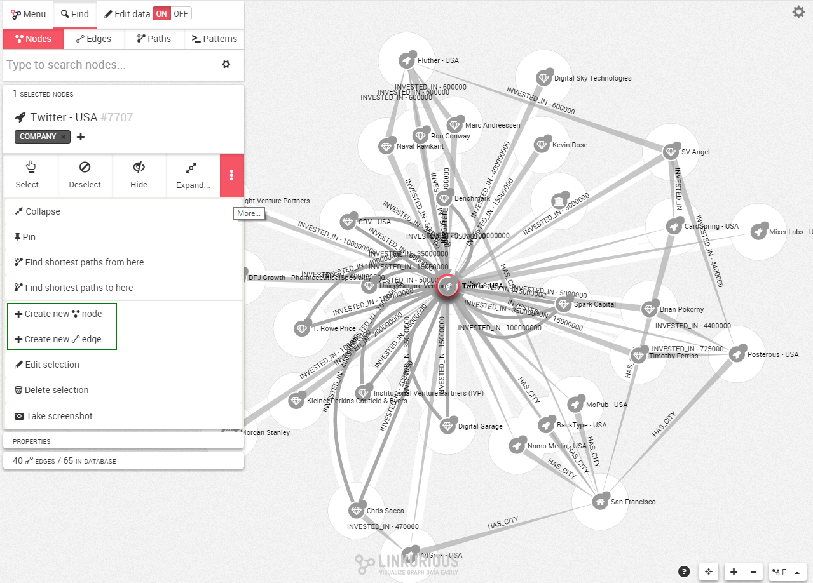
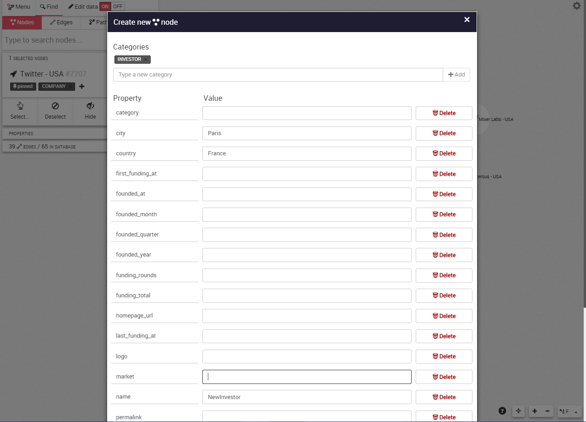
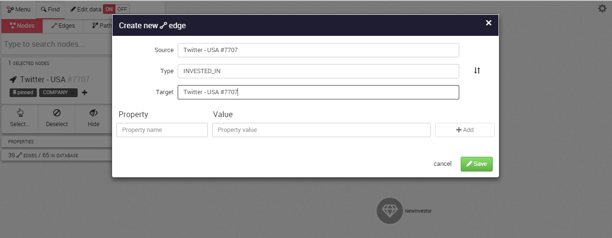
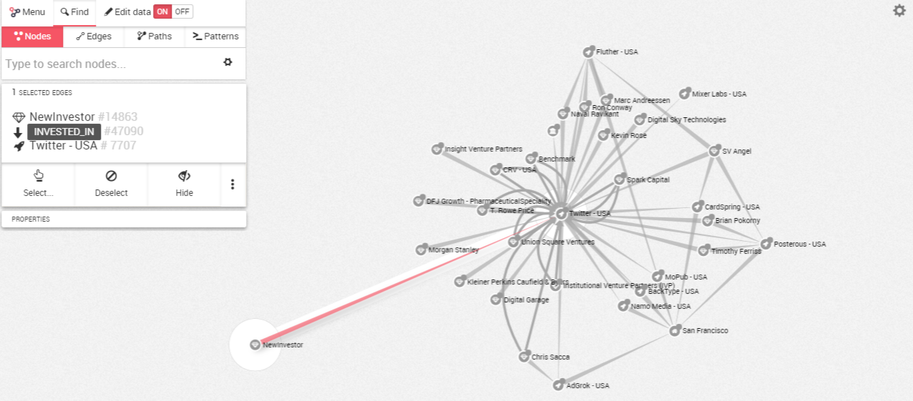

## Add a node or a relationship

On the ```more options``` panel, we can choose to create either a node or an edge




**If we choose to create a node**: we enter a value for the ```Categories```here Investor and hit add. Then for each property of our node, we enter the name of the property and its value. When it is done, we hit ```Save```.
.



Here we entenred the value ```Paris``` for the City property, the value ```France``` for the Country property and the value ```NewInvestor``` for the Name property


**If we choose to create an edge**, we have to provide the following information :

* ```Type```: the type of relationship;
* ```Source```: the source of the relationship;
* ```Target```: the destination of the relationship.

Like for the nodes, we can add as many properties as we want to the edge. When we are done, we simply click on ```Save```.



Here we entered the value ```NewInvestor #14863``` for the Source, the value ```INVESTED_IN``` for the Type property and the value ```Twitter - USA #7707``` for the Name property


Finally, we can see in our graph our new node and our new edge:

