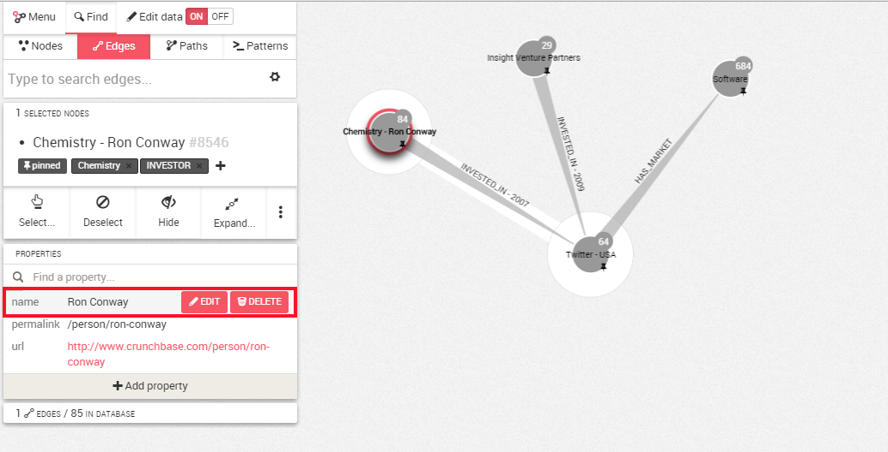
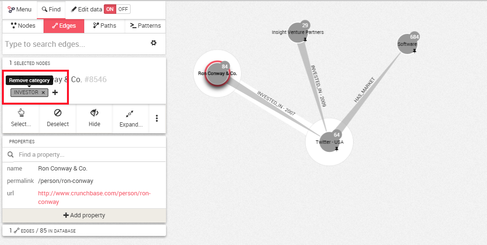
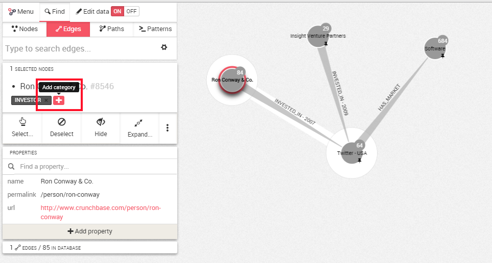

## Edit properties and categories

###Edition Mode

First of all we need to switch the edition mode to ```On``` in the top left corner.


###Editing or deleting a property

Now if we select a node or an edge and move the mouse cursor next to a property, we can ```Edit``` or ```Delete``` it.



If we click on ```Edit```, we can change the value of the property.
When we are finished, we  click on  ```Save```. Here we will edit the Name of the Company.


If you wish to delete a property, simply click on ```Delete```.

###Editing or deleting a category

It is possible to add or remove a category to an edge or a node.




Click on the ```x``` next to the category to remove it.

To add a category, we click on ```+```. For example, we, might be interested to add in our graph the activity of the investors. 



Here we had the category Angel Investor to precise the field of work of the company Ron Conway

We type the new category, here  ```Angel Investor```. We hit ```Save```.

The category is added.


