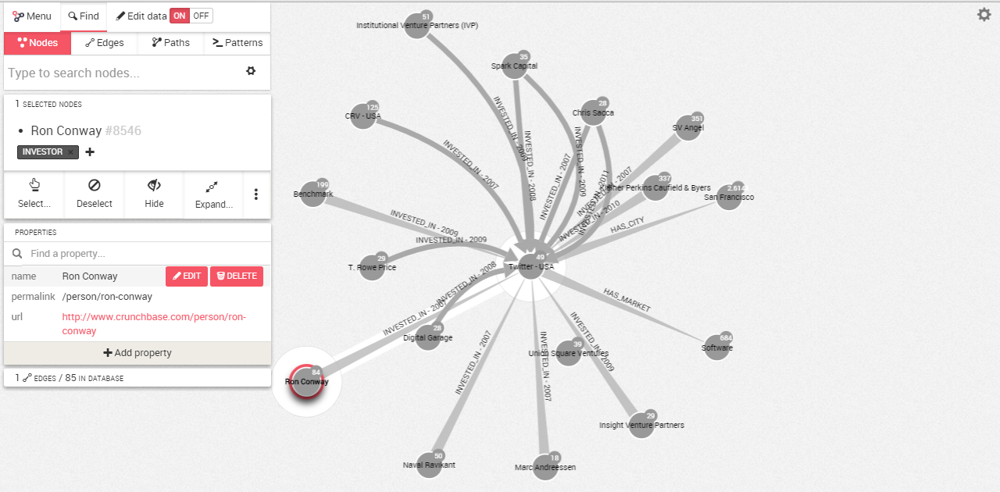
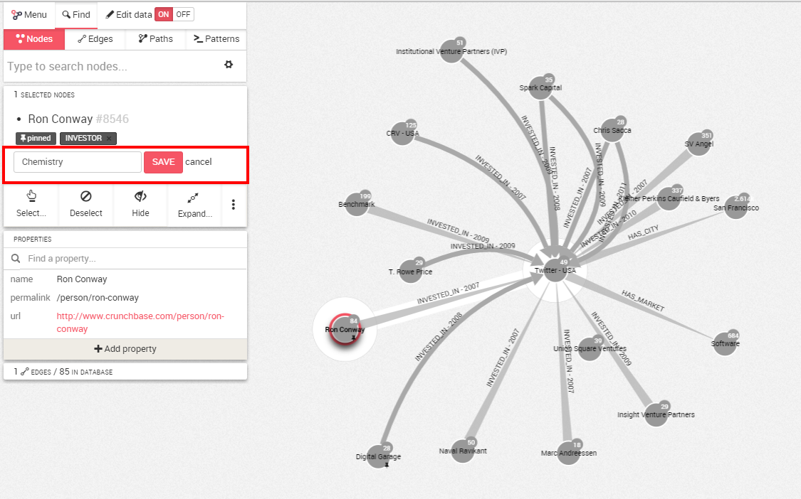

## Edit a node or an edge

###Edition Mode

First of all we need to switch the edition mode to ```On``` in the top left corner.


###Editing or deleting a property

Now if we select a node or an edge and move the mouse cursor next to a property, we can ```Edit``` or ```Delete``` it.



If we click on ```Edit```, we can change the value of the property.
When we are finished, we simply click on  ```Save```.


If you wish to delete a property, simply click on ```Delete```.

###Editing or deleting a label

It is possible to add or remove a category to an edge or a node.


Click on the ```x``` next to the label to remove it.

To add a label, we click on ```+```.




We type the new label, here  ```Chemistry```. We hit ```Save```.

The label is added.

