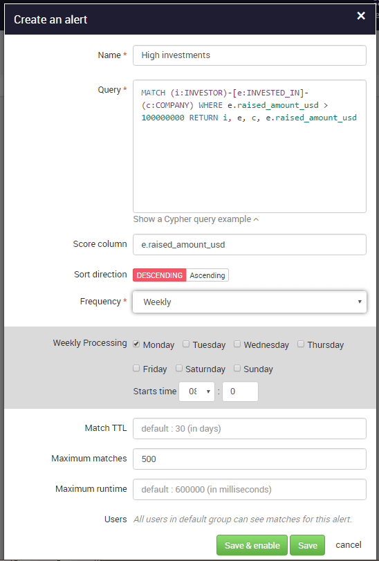
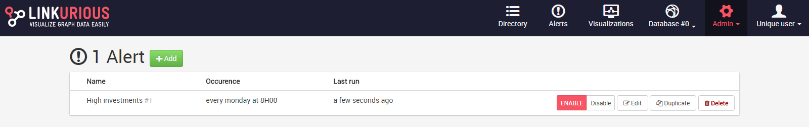

# Alerts

Administrators can create and manage alerts from the **Admin > Alerts** panel. Alert matches are the result of pattern queries run on the graph database. Pattern queries are crafted according to the anomalies or suspicious activities to look out. 

  Linkurious 1.4+ supports Cypher queries on Neo4j 2+.

We can configure alerts as follows: an alert has a title, query, and run frequency. The RETURN statement of the query may contain a numerical value that represents the score of each match. Alerts can be run monthly, weekly, daily, hourly, or even every minute. It is possible to enter a CRON value. Matches will be erased from Linkurious after a given period called time-to-live (TTL). Linkurious can store a finite number of matches per alert. If a score is defined, only the top matches are stored. Currently all Linkurious users that belong to the *default* group will access the alerts.

Alerts can be managed from the **Admin > Alerts** panel. We can enable/disable them, edit them, see the last running time and get notifications of issues. We can easily create new alerts by duplicating existing ones, or deleting alerts. 

  All matches of a deleted alert are deleted as well, so you may want to disable alerts instead after analysts have worked on them.

