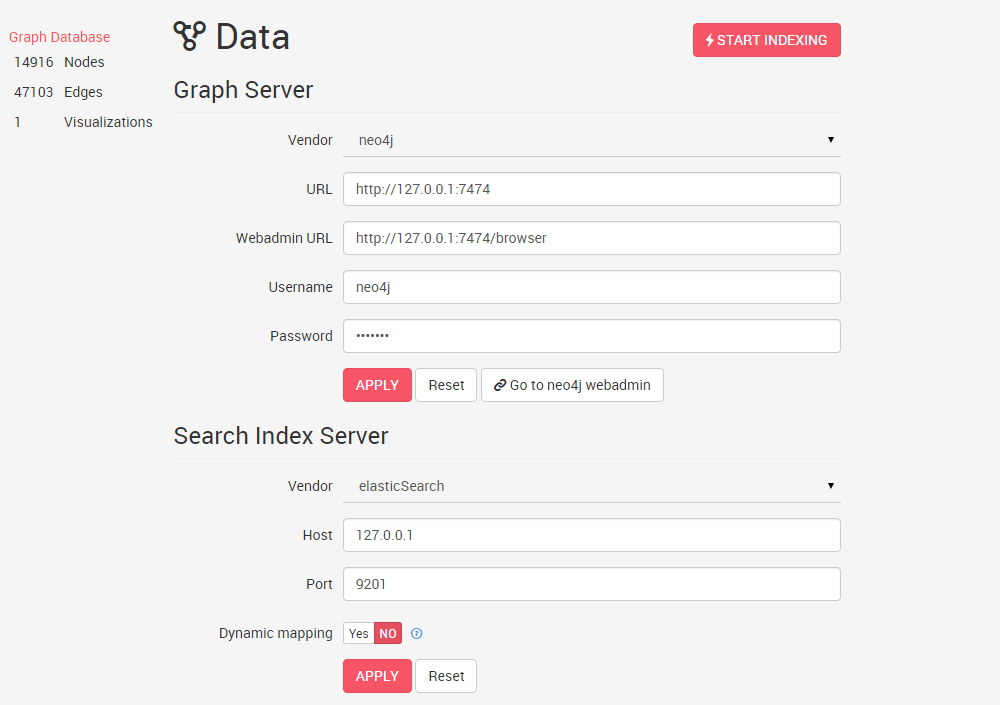

## Data sources

Linkurious Enterprise connects to local or remote data sources through HTTP and HTTPS. Data sources such as Neo4j servers may provide access to different graph databases. For instance, it is common to see Neo4j users switch between graph databases on the same Neo4j server. Linkurious Enterprise handles multiple data source configurations and detects which databases are currently available behind the connected data sources.

### Add a new data source

1. Open the linkurious folder in your computer.
- Open the file located at `linkurious/data/config/production.json` with your favorite text editor.
- Look for the `dataSources` key. It is an array of data source configurations. By default, a single data source is defined to connect to a Neo4j server located at `http://localhost:7474/`. Duplicate the default configuration and edit `graphdb` vendor and `url` to define a second data source.
- Restart Linkurious to take changes into account.

### Edit a data source from the data management dashboard

To access the data management dashboard, click on **Data** in the administrator dashboard, or selects the **Data** item in the **Admin** menu of the navigation bar. You should see the following screen.

We can edit here the data source configuration, set up and trigger data indexing. To edit the configuration of another data source, switch the data source from the navigation bar.

### Search server

The search feature uses [Elasticsearch](https://www.elastic.co/products/elasticsearch) for real-time full-text search in nodes and relationships. An embedded Elasticsearch server is shipped with Linkurious but you may set up your own. All data sources are indexed into the same Elasticsearch instance by default; you may configure different Elasticsearch instances for each data source. Please refer to the official documentation of Elasticsearch to set up your own cluster.
