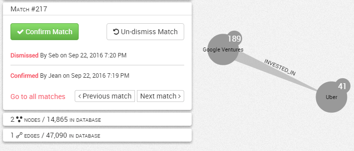

# Audit trail of an alert match

When investigating a match on the Workspace, every change of the match status is logged and displayed on the Match panel. In the following example we see that Jean has confirmed the match, but Seb disagrees and has dismissed it after discussing the case together.

