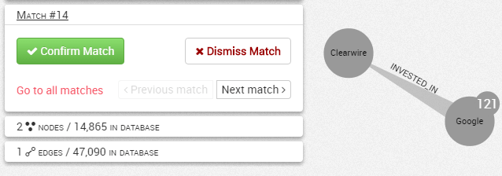

# Investigate an alert match

We visualize a match within the Workspace. A specific "Match" panel on the left displays buttons to un/confirm or un/dismiss the match. We can go back to the list of matches, or press Previous/Next match to navigate the list of matches without leaving the Workspace.

All features of the Workspace are available for a complete investigation, including expanding nodes and applying alternative styles. We can save the visualization in the user Dashboard, and share it with colleagues.

