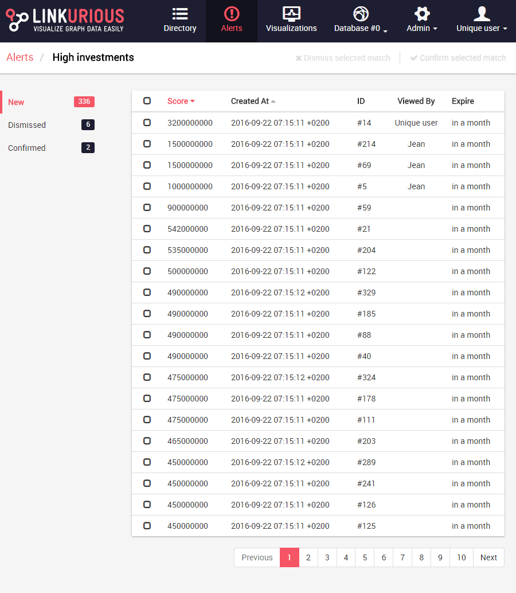
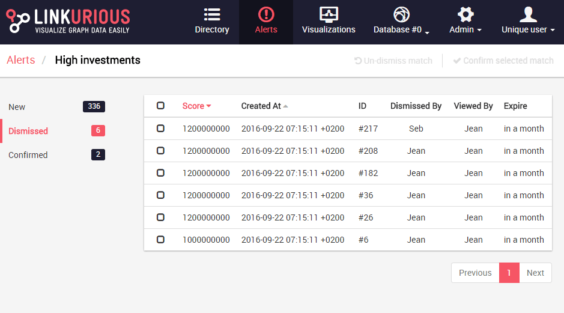

# Matches for an alert

After clicking on an alert we get the list of newly detected matches. Matches may be ordered by score if a score has been defined. We can always order matches by creation date. 

We can easily organize a team as we see the other users who have opened a match. Each row represents a match.

A match is either new, confirmed, or dismissed. On the left we can access the list of matches by status. For instance the following image shows the list of dismissed matches. We can see who has changed the status of those matches.

We can select one or multiple rows to confirm or dismiss the corresponding matches. But most of the time we need to investigate a match before making a decision. Simply click on a row to open the visualization.
