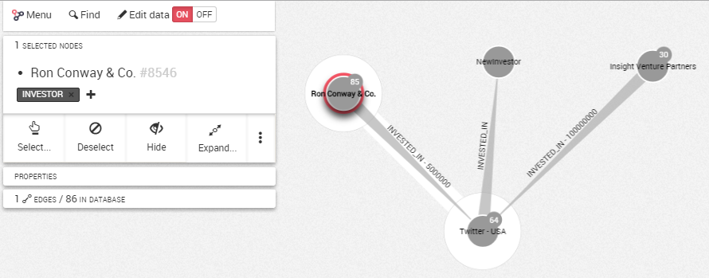
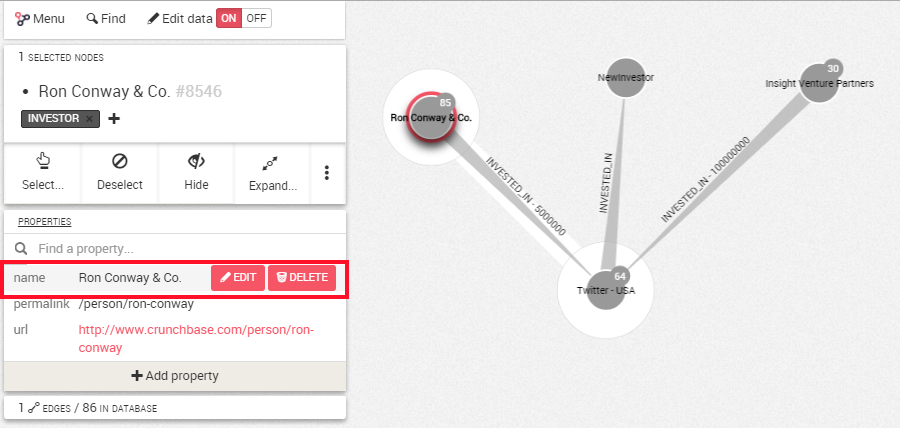
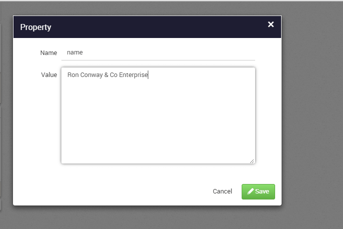
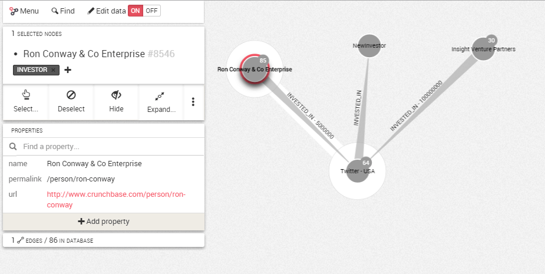
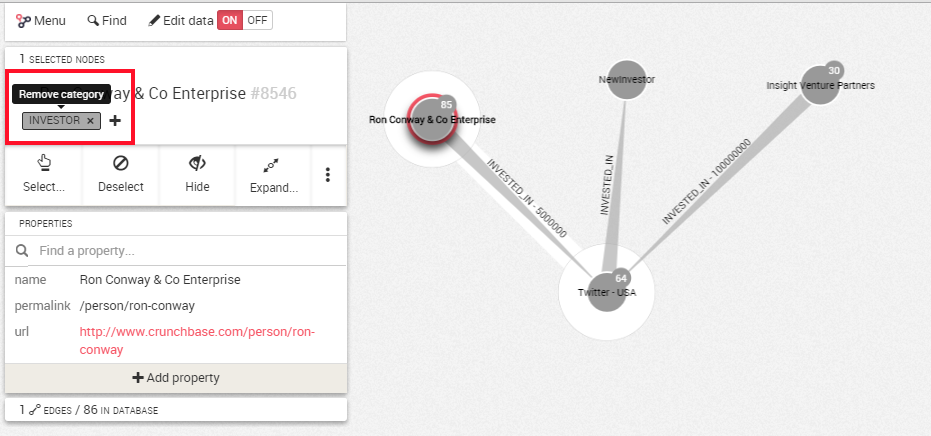
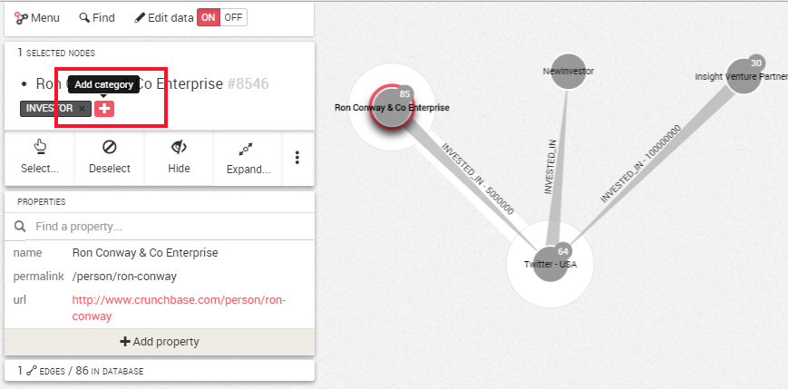
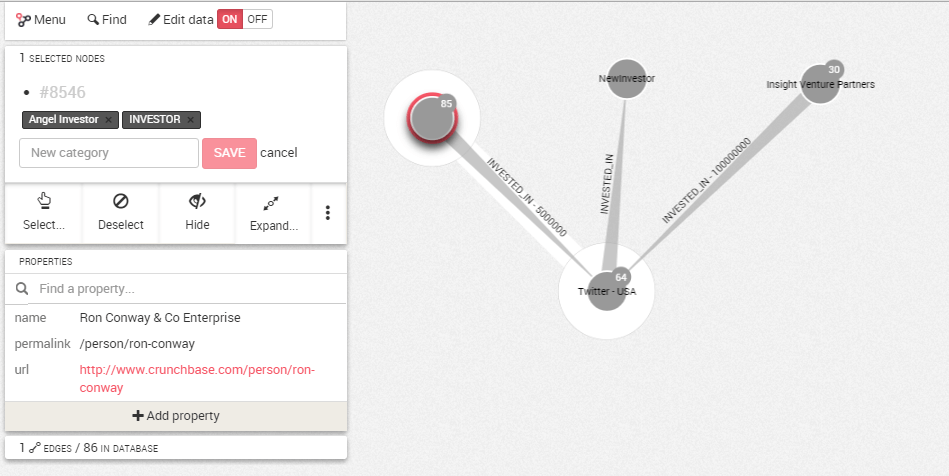

## Edit properties and categories

Properties are key-value information stored in nodes and edges. It can be the name of a company for instance. Categories are special information to tag nodes and edges. Nodes can be of category Investor or Company, or both.

<div class="alert alert-info">
    In Neo4j databases, edges have one and only one category. It is not possible to modify it.
</div>

###Edition Mode

First of all we need to switch the edition mode to ```On``` in the top left corner.



###Editing or removing a property

Now if we select a node or an edge and move the mouse cursor next to a property, we can ```Edit``` or ```Delete``` it.



If we click on ```Edit```, we can change the value of the property.
When we are finished, we  click on  ```Save```. Here we will edit the Name of the Company.




If you wish to delete a property, simply click on ```Delete```.

###Editing or removing a category

It is possible to add or remove a category from a node.




Click on the ```x``` next to the category to remove it.

To add a category, we click on ```+```. For example, we might be interested to add in our graph the activity of the investors. 



Here we had the category Angel Investor to precise the field of work of the company Ron Conway.

We type the new category, here  ```Angel Investor```. We hit ```Save```.

The category is added.




