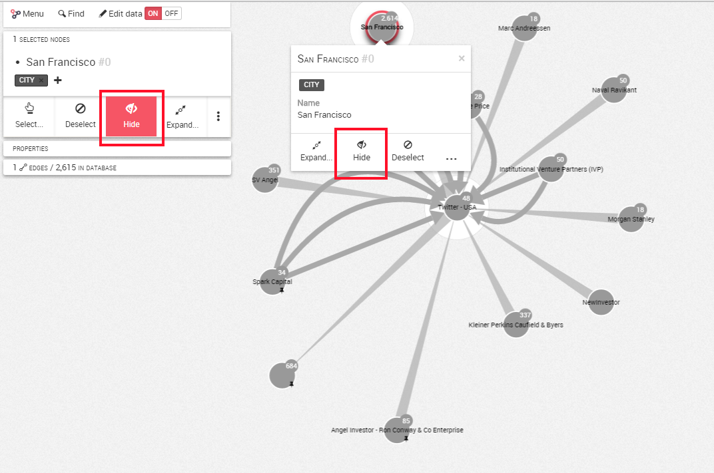
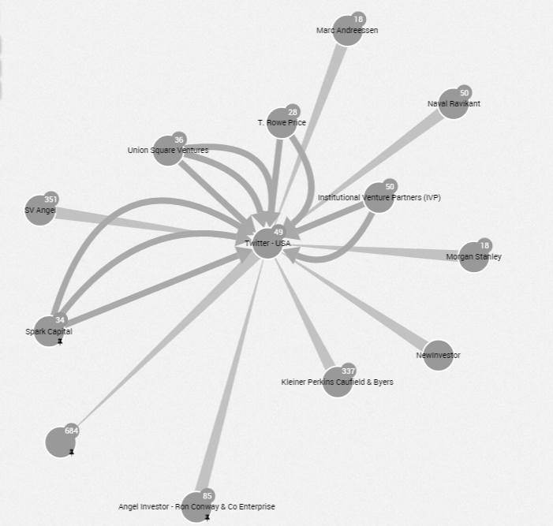
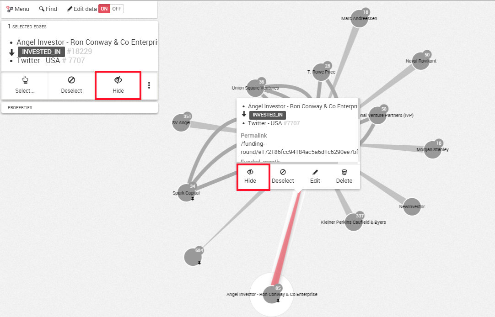
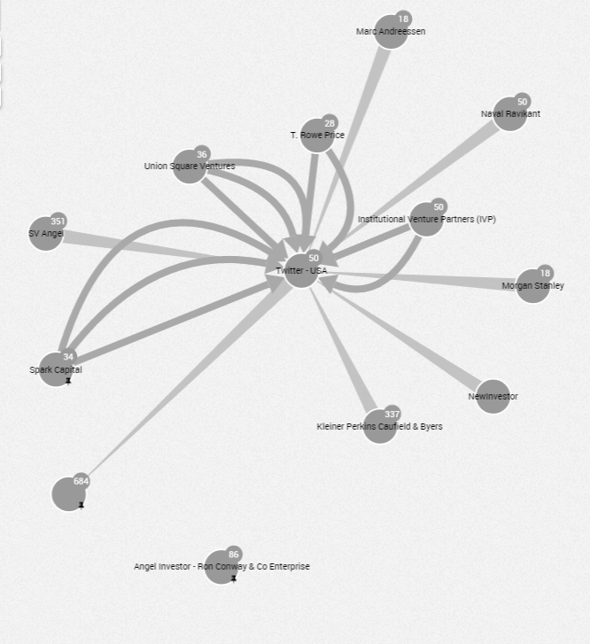

## Remove nodes and edges

###Remove a node

If we want to remove a node from our visualization, we select the node we are interested in removing by clicking on it then either:

- Hit the ```Hide``` button on the left panel as below:
- By a right-click, we also can access to the ```Hide``` button





###Remove an edge

If we want to remove an edge from our visualization, we select the edge we are interested in removing by clicking on it then either:

- Hit the ```Hide``` button on the left panel as below:
- By a right-click, we also can access to the ```Hide``` button





