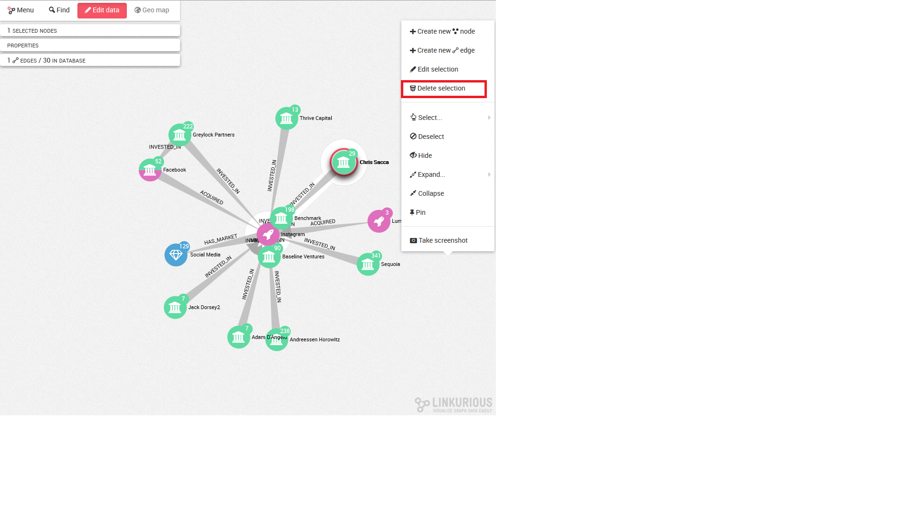
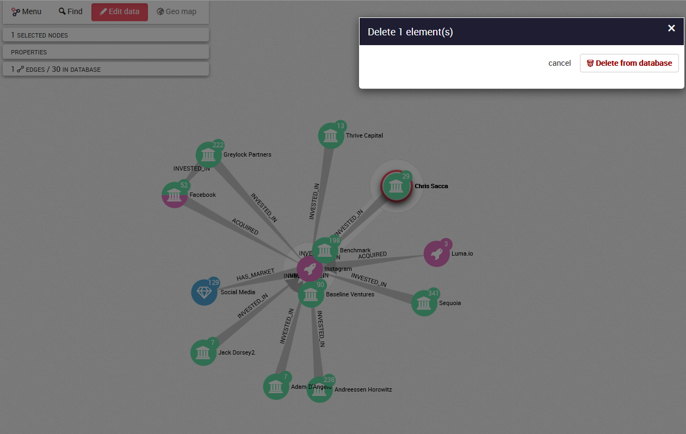
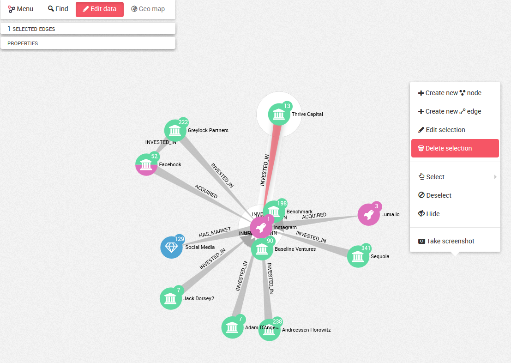
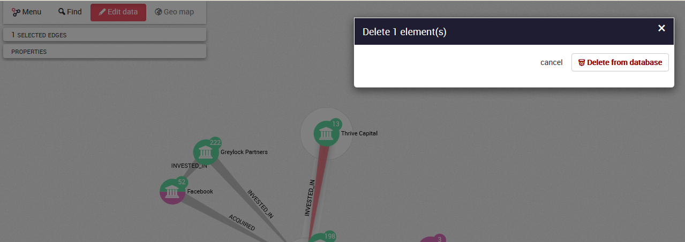
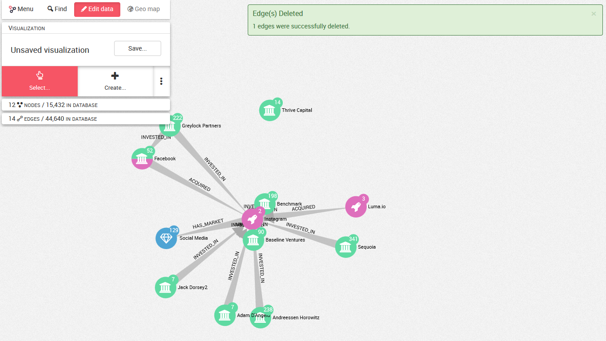

## Delete the nodes and the edges

### DElete a node


If we want to delete a node from our database, we select the node we want to delete and we right clic on the background of our graph. We clic on```Delete selection``` in the menu as shown below then we clic on ```Delete from Database```.






The node is deleted from the database.


### Delete an edge 

IF we want to delete an edge from our database, we select the edge we want to delete then we right clic on the background of our graph. We clic on ```Delete selection``` in the menu as shown below then we clic on ```Delete from Database```.






The edge is deleted from the database.



