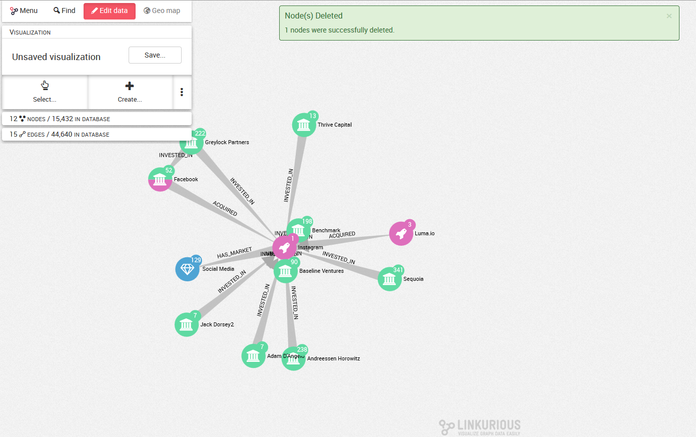

## Delete nodes and edges

### Delete a node


If we want to delete a node from our database, we select the node we want to delete and we right-click on the background of our graph. We click on```Delete selection``` in the menu as shown below then we click on ```Delete from Database```.


The node is deleted from the database.





### Delete an edge 

If we want to delete an edge from our database, we select the edge we want to delete then we right-click on the background of our graph. We click on ```Delete selection``` in the menu as shown below then we click on ```Delete from Database```.


The edge is deleted from the database.


