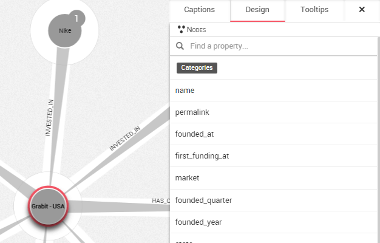
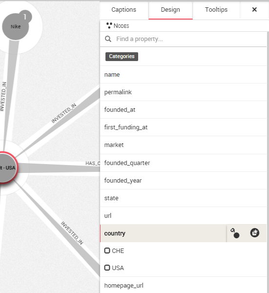

## Filtering the nodes according to a property

At some point in our graph exploration, we may want to focus on a specific part of our current visualization. A good way to do that is to use filters.

Filters enable us to select or hide multiple nodes or edges at once according to a specific property.

In the graph below, we see the companies who have invested in [Grabit](http://www.banexiventures.com/) small firm form the USA.


Where are these companies located in? We could color the nodes according to their ```country``` property to know that. But what if we only want to see the American companies Grabit is involved with?

To do that, we open the design panel on the right.



We can see the different properties associated with the nodes in our graph.

We are going to click on ```country```. The different values present in our graph for the property ```country``` appear.



We can see that there are companies from ```CHE``` and ```USA```.


To select the companies from USA, we fill the check boxes (here we have colored the nodes, see Style > Color nodes, in order to make the filter action more visible):

Now, on the top of the design panel two buttons appear :  ```Filter ``` and  ```Select ```.

To select all the nodes from USA, we could click on ```Select ```. Instead we are going to choose ```Filter ```.


Instantly, all the nodes with the values ```CHE``` are removed from the visualization

We can see on the bottom right corner, a symbol for the filter we added to the visualization is created.

Filtering is a great way to remove unimportant information from a visualization. Use it accordingly!
