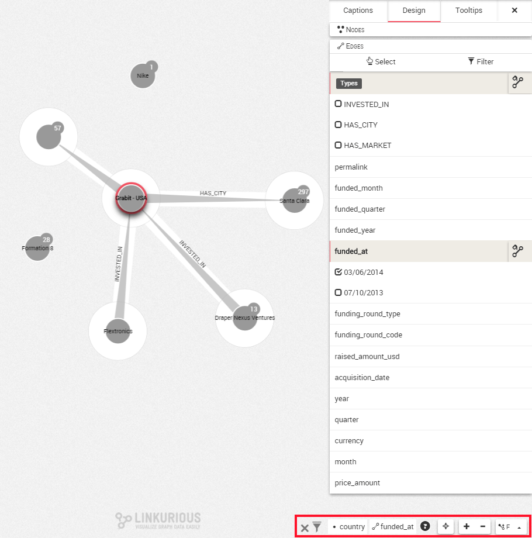
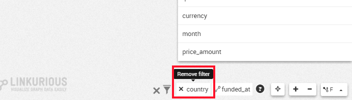
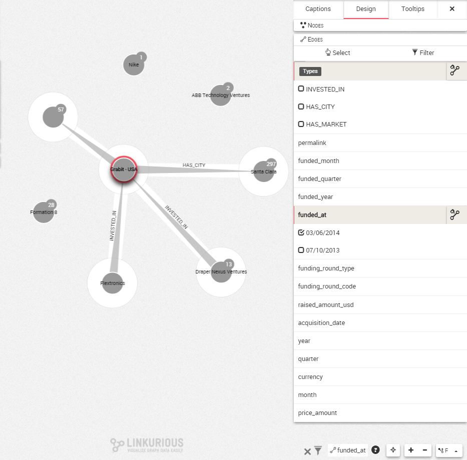

## Remove filters

So we have applied one or several filters to your visualization. Maybe it was a mistake or maybe we want to go back a step. How to remove a filter?

An icon for each filter we create is added on the bottom right corner of the screen. The first filter is on the right and the latest on the left.



In this visualization, there are two filters. The nodes are filtered according to the ```country``` property. The edges are filtered according to the ```funding_at``` property.

To remove the ```country``` filter, we click on the cross next to its icon.



The filter is instantly removed. The nodes it hid are then added back to the visualization. The **other** filter remains active.


