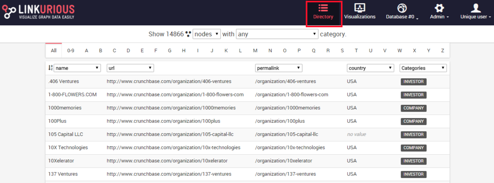

##At first glance

Here is a look at the interface of Linkurious Enterprise.

### Dashboard

The dashboard lists the visualizations created by the user. The following image shows a typical dashboard after starting to use Linkurious.

![dashboard]](https://raw.githubusercontent.com/Linkurious/linkurious-enterprise-manual/master/screenshots/157.png)

### Directory

The directory lists all indexed nodes and edges of the graph database in a tabular display.

### Workspace

The workspace allows to explore the graph database and craft the visualization as a node-link diagram.

![workspace]](https://raw.githubusercontent.com/Linkurious/linkurious-enterprise-manual/master/screenshots/159.png)
