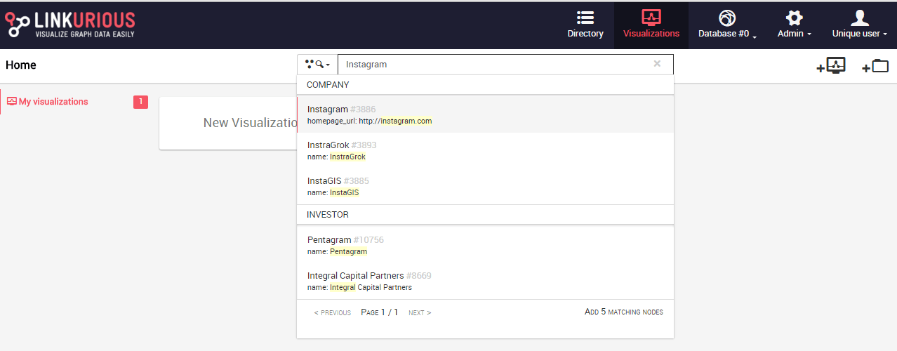
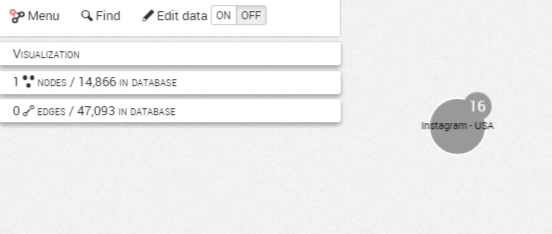
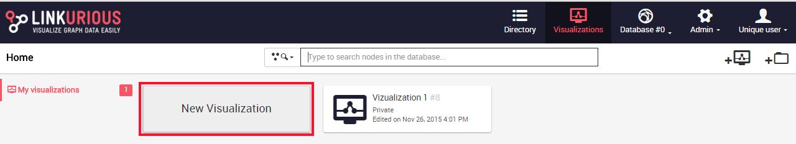
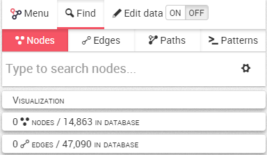
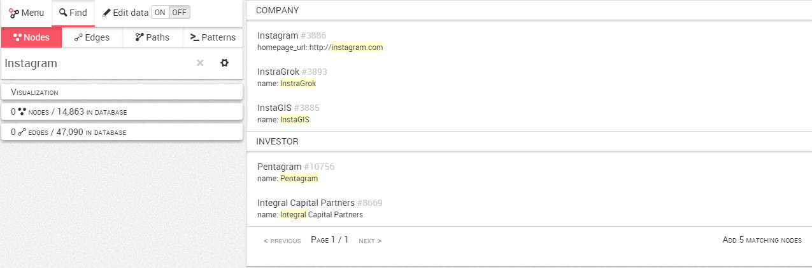
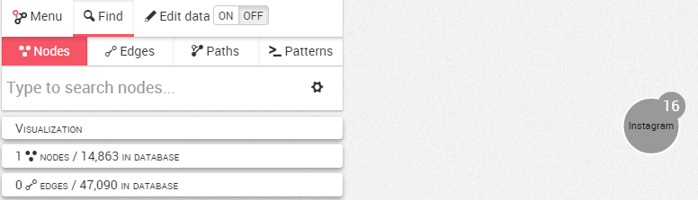

## Create a new visualization

### From the Quicksearch bar

We can start to explore the data and have a rapid look at a node and its relations through the Quick Search bar. The Quick Search bar is accessible directly from the Dashboard. 
Here we will look for the Company Instagram.



Several results matching the database are proposed, we can select the one we are interested in and a visualization is created:



### From New Visualization

An alternative is to create a new visualization,  we click on ```New visualization``` on the Dashboard.



We can now search for nodes and edges.




For example, if we want to look for the company Instagram, we simply type the name of any property associated with this node. Here, we type ```Instagram```, which is the name of the company. Few suggestions appear containing the word Instagram in one of their properties, we clik on the one we are interested in.



Here we selected the company Instagram. The node appears in the graph area.


