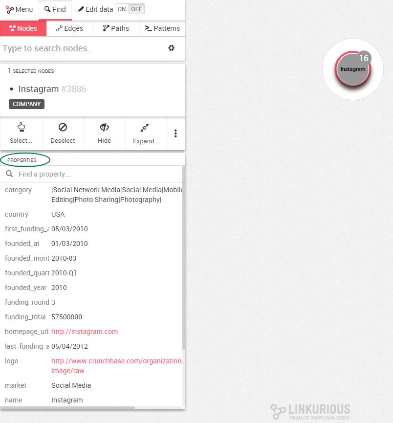
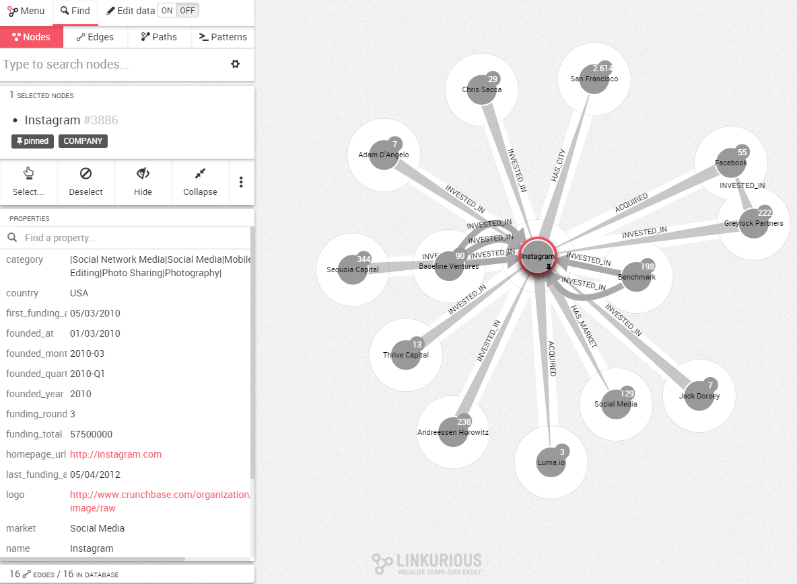
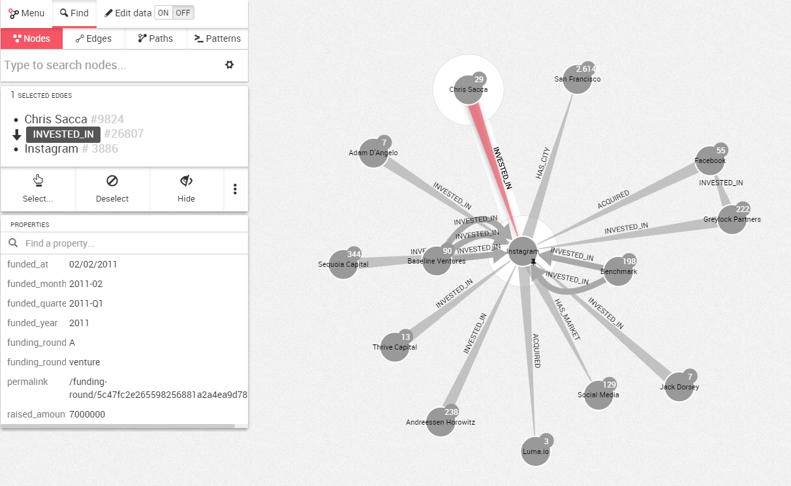

## Inspect nodes

In order to view the different properties of a node, we click on it. Information immediately appears on the left side of the screen.



Here we can see that there is a node with the id ```#3886```. It is called ```Instagram``` and has a ```Company``` category. Below we can see the various properties associated with the node.

For example the node has a ```country``` property with the value ```USA```.

We can scroll down to see more properties or use the search bar to find a property.

Notice the number next to the node, it is the number of undisplayed relationships.

If we want to hide the left panel, we simply click on ```PROPERTIES``` (green circle).

Inspect edges in the same manner.


## Display the connections of a node

Time to find out about the particular relationships of a node. The easiest way to get that information is to double-click on the ```node``` we are interested in. Here we are interested in [Instagram](http://instagram.com/).


Now we can see all the nodes that are connected to Instagram.



Notice the white halo around each node? All the nodes surrounded by the white halo are connected to the currently selected node (or nodes). In this case, all the nodes are connected to Instagram.

The edges between the nodes represent the relationships. All the edges have a direction from one node (the node where the base of the edge is large) to another (the pointy end of the arrow).

If we click on a given ```relationship```, the properties of that relationship will be displayed in the left panel.


