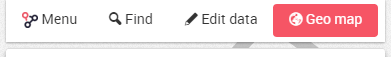
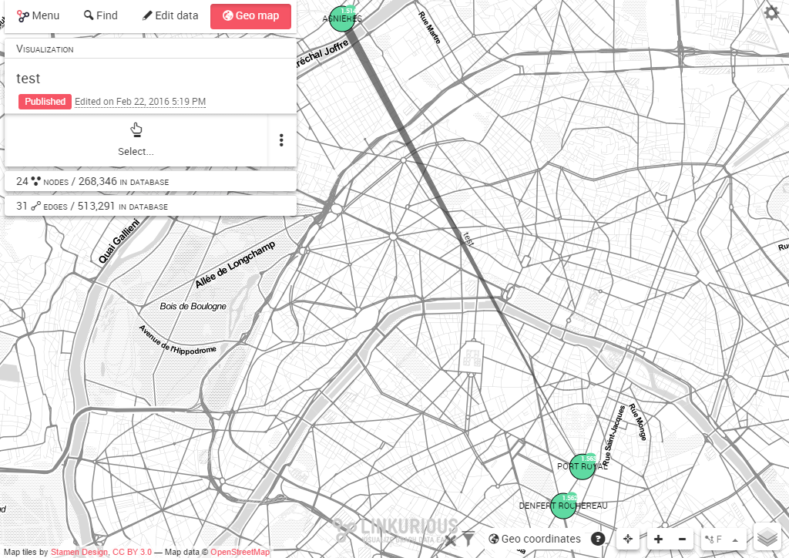
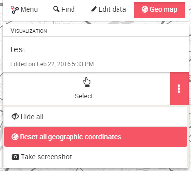
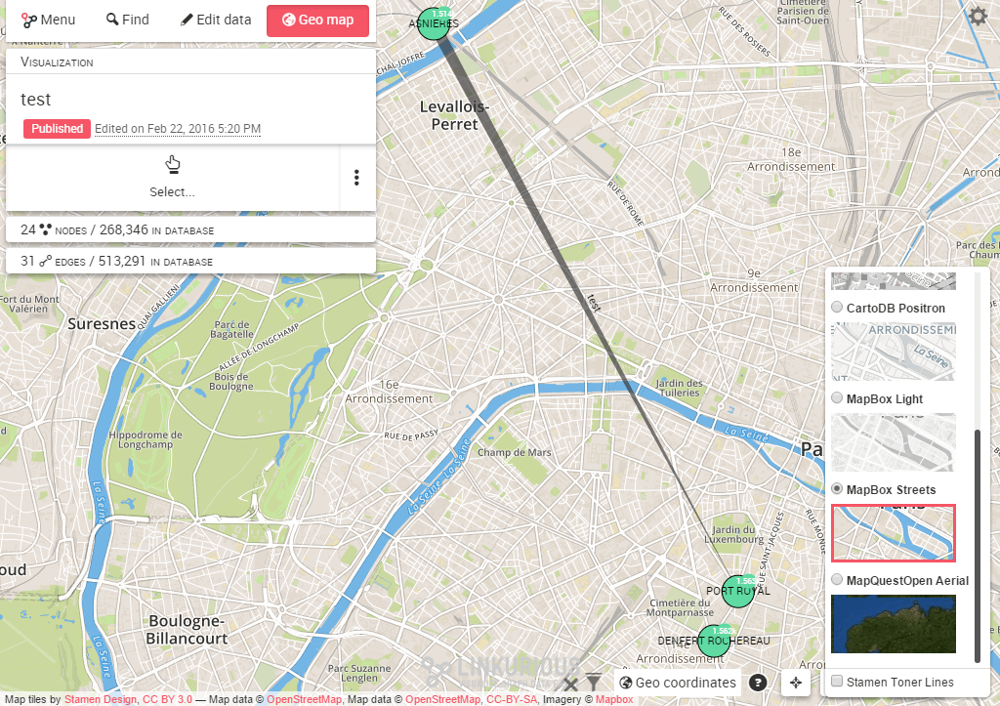
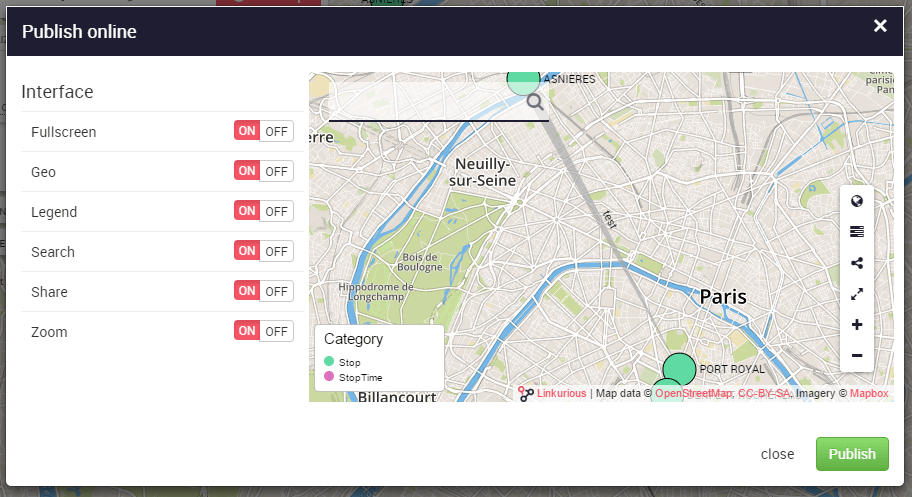

# Geo mode

The geo mode switch is available on the left panel of the Workspace. 
You can enable and disable the geo mode at will to switch between the standard "network" view and the geographic view.

Click on it to display the geographical map. Nodes are positionned on the map according to their geographic coordinates. Other nodes are hidden by the "geo coordinates" filter.

You can zoom in and out, drag nodes on the map to improve readability, select nodes and edges, etc. You can always reset the node coordinates to their original location via the actions menu:

Hover the layer icon  on the bottom-right of the Workspace with your mouse. The list of available layers is displayed. You can pick another basemap and add overlays, depending on those available on your instance of Linkurious as seen below:

Finally, you can publish an interactive widget from **Workspace menu > Publish** with the geographical layers. See the **Manage > Publish** chapter to know more.

