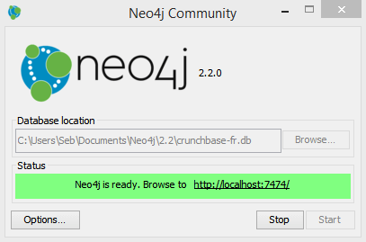
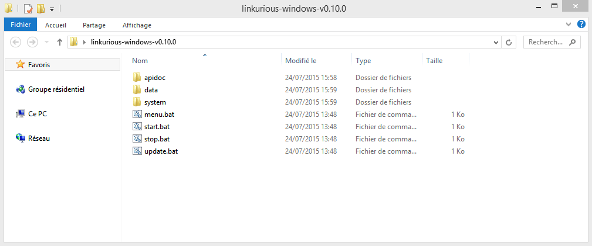
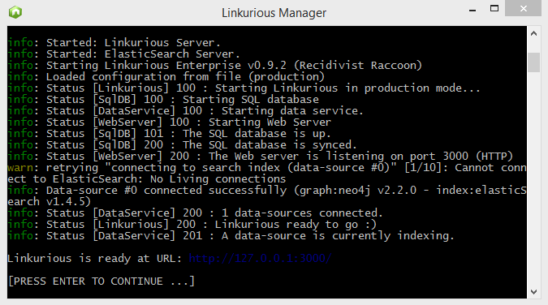

## Start

Before running Linkurious, please launch your Neo4j server and setup your credential first. Neo4j 2.2 introduces basic authentication by default, see the Configure section to learn more.

### Run on Linux systems

Start Linkurious: run `start.sh`. Alternately, run `menu.sh` and select `Start Linkurious processes` from the console.

**Example output:**
```Text
info: Loaded configuration from file (production)
[PM2] Spawning PM2 daemon
[PM2] PM2 Successfully daemonized
info: Started: Linkurious Server.
info: Started: ElasticSearch Server.
info: Starting Linkurious Enterprise v0.10.0
info: Loaded configuration from file (production)
info: Status [Linkurious] 100 : Starting Linkurious in production mode... 
info: Status [SqlDB] 100 : Starting SQL database 
info: Status [DataService] 100 : Starting data service. 
info: Status [WebServer] 100 : Starting Web Server
info: First run, initialization ...
info: Status [SqlDB] 101 : The SQL database is up.
info: Status [SqlDB] 200 : The SQL database is synced.
info: Status [WebServer] 200 : The Web server is listening on port 3000 (HTTP)
info: Data-source #0 connected successfully (graph:neo4j v2.1.6 - index:elasticSearch v1.4.5)
info: Status [DataService] 200 : 1 data-sources connected. 
info: Status [Linkurious] 200 : Linkurious ready to go :) 
info: Status [DataService] 201 : A data-source is currently indexing.
Linkurious is ready at URL: http://127.0.0.1:3000/
```

As you can notice, the Linkurious server is available by default on port 3000. However, some firewalls block network traffic ports other than 80 (HTTP). See the Configure section to listen traffic on port 80.


### Run on MAC OS X


Start Linkurious: run `start.sh.command`. Alternately, run `menu.sh.command` and select `Start Linkurious processes` from the console.

**Example output:** 
```Text
info: Loaded configuration from file (production)
[PM2] Spawning PM2 daemon
[PM2] PM2 Successfully daemonized
info: Started: Linkurious Server.
info: Started: ElasticSearch Server.
info: Starting Linkurious Enterprise v0.10.0
info: Loaded configuration from file (production)
info: Status [Linkurious] 100 : Starting Linkurious in production mode... 
info: Status [SqlDB] 100 : Starting SQL database 
info: Status [DataService] 100 : Starting data service. 
info: Status [WebServer] 100 : Starting Web Server
info: First run, initialization ...
info: Status [SqlDB] 101 : The SQL database is up.
info: Status [SqlDB] 200 : The SQL database is synced.
info: Status [WebServer] 200 : The Web server is listening on port 3000 (HTTP)
info: Data-source #0 connected successfully (graph:neo4j v2.1.6 - index:elasticSearch v1.4.5)
info: Status [DataService] 200 : 1 data-sources connected. 
info: Status [Linkurious] 200 : Linkurious ready to go :) 
info: Status [DataService] 201 : A data-source is currently indexing.
Linkurious is ready at URL: http://127.0.0.1:3000/
```


### Run on Windows

First of all, in order to use Linkurious you need to [launch Neo4j](http://neo4j.com/download/).




Once the Neo4j server has successfully started, go to the folder of Linkurious.



Click on the `start.bat` file. Linkurious starts and invites you to open up your browser to http://localhost:3000 to access the user interface. Alternately, click on `menu.bat` and select `Start Linkurious processes` from the console.



<div class="alert alert-warning">
    <i class="octicon octicon-stop"></i> The firewall of Windows might ask you to authorize connections with Linkurious: if so, click on Authorize access.
</div>

Linkurious will index the graph database the first time you launch it. You can follow the indexing progress in the terminal. Once done you can use Linkurious!


