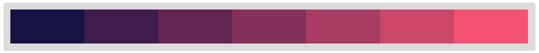
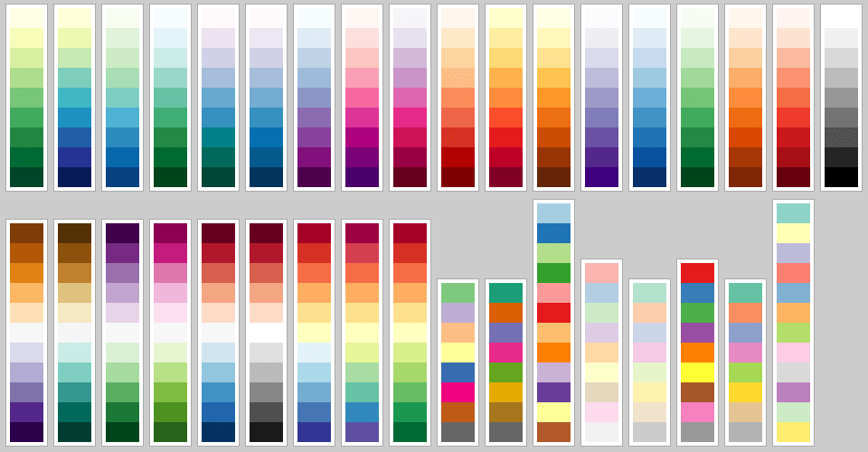

### Visualization style

You can configure the installation of Linkurious Enterprise to customize the default visual aspect of nodes and edges in new visualizations, so that your users will jump head first into the exploration of data. Nodes and edges are grey and have the same size by default. The defined styles will be applied to **all** data sources.

Open the configuration file `linkurious/data/config/production.json`. Visualization styles are defined within the `sigma` key by the `styles` and color `palette`. Styles are mapping between visual variables such as colors or size, and data properties on nodes and edges. Visual variables can be used in a single style at a time. For instance we can set `nodes.color` and `nodes.icons`, but we cannot set `nodes.color` twice. We can set `nodes.color` and `edges.color`.

Palettes may contain color schemes for both quantitative and qualitative properties, as well as schemes for icons. Schemes for qualitative properties bind property values to colors. Schemes for quantitative properties bind the number of property values to lists of sequential colors. Schemes may be nested and be referenced in dot notation by the styles.

Available `styles.nodes.by` values:
- "data.categories"
- "data.properties.X", with "X" the property name.

Available `styles.edges.by` values:
- "data.type"
- "data.properties.X", with "X" the property name.

#### Color mapping

In the following example, nodes are colored by categories "COMPANY", "CITY", "MARKET", "INVESTOR", and edge are colored by type "HAS_CITY", "HAS_MARKED", "INVESTED_IN". Notice how each color palettes is referenced in schemes.

**Example for qualitative properties:**
```json
"styles": {
  "nodes": {
    "color": {
      "by": "data.categories",
      "scheme": "nodes.qualitative.categories"
    }
  },
  "edges": {
    "color": {
      "by": "data.type",
      "scheme": "edges.qualitative.type"
    }
  }
},
"palette": {
  "nodes": {
    "qualitative": {
      "categories": {
        "INVESTOR": "#5FDAA2",
        "COMPANY": "#DE6FBC",
        "MARKET": "#4EA4D4",
        "CITY": "#D4742C"
      }
    }
  },
  "edges": {
    "qualitative": {
      "type": {
        "INVESTED_IN": "#5FDAA2",
        "HAS_CITY": "#DE6FBC",
        "HAS_MARKET": "#4EA4D4"
      }
    }
  }
}
```

Coloring by quantitative property follows the same logic. In the following example the nodes are colored by a numeric property. Values will be linearly grouped into 7 bins, ordered from small to large values (see an example below).



**Example for quantitative properties:**
```json
"styles": {
  "nodes": {
    "color": {
      "by": "data.properties.my_score",
      "scheme": "nodes.quantitative"
    }
  }
},
"palette": {
  "nodes": {
    "quantitative": {
      7: ['#161344','#3f1c4c','#632654','#86315b','#a93c63','#cd476a','#f35371']
    }
  }
}
```

#### Color palette

Linkurious will always use 7 colors for quantitative properties of the nodes, and 3 colors only for edges. The human eye can distinguish a few colors only, so you should craft your palette carefully.

If you do not set styles for qualitative properties, Linkurious will assign colors from a randomly -but carefully- generated set of colors. This set can be modified at `palette.nodes.qualitative.linkurious_def` (edges respectively).

Be careful to never delete `linkurious_def` or `sequential` because they are used by Linkurious.

We recommend to pick colors from the [ColorBrewer palette](https://github.com/Linkurious/linkurious.js/blob/develop/plugins/sigma.plugins.colorbrewer/sigma.plugins.colorbrewer.js), which provides highly distinctive sets of colors (see below).



You can also generate consistent color scales for qualitative data on http://gka.github.io/palettes/ .

#### Node icons

Linkurious provides more than 500 icons from the FontAwesome project. You can assign icons using their unicode characters such has "\uf219". Get the complete character map at http://fortawesome.github.io/Font-Awesome/icons/ (select an icon to display the unicode).

The following example set icons to node categories "COMPANY", "CITY", "MARKET", "INVESTOR".

**Example;**
```json
"styles": {
  "nodes": {
    "icon": {
      "by": "data.categories",
      "scheme": "nodes.icons.categories"
    }
  }
},
"palette": {
  "nodes": {
    "icons": {
      "categories": {
        "INVESTOR": {"font": "FontAwesome", "scale": 1, "color": "#fff", "content": "\uf19c"},
        "CITY": {"font": "FontAwesome", "scale": 1, "color": "#fff", "content": "\uf015"},
        "COMPANY": {"font": "FontAwesome", "scale": 1, "color": "#fff", "content": "\uf135"},
        "MARKET": {"font": "FontAwesome", "scale": 1, "color": "#fff", "content": "\uf219"}
      }
    }
  }
}
```

#### Node images

*This feature is experimental and not yet available from the user interface.*

Nodes can be filled with an image if one of their property is an URL to an image. Available image formats are PNG, JPG, GIF, or TIFF. The following example set images to node categories "COMPANY", "CITY", "MARKET".


**Example;**
```json
"styles": {
  "nodes": {
    "image": {
      "by": "data.categories",
      "scheme": "nodes.images"
    }
  }
},
"palette": {
  "nodes": {
    "images": {
      'COMPANY': {
        url: 'http://example.com/img/company.png', scale: 1.3, clip: 0.85
      },
      'CITY': {
        url: 'http://example.com/img/city.png', scale: 1.3, clip: 0.85
      },
      'MARKET': {
        url: 'http://example.com/img/market.png', scale: 1.3, clip: 0.85
      }
    }
  }
}
```
