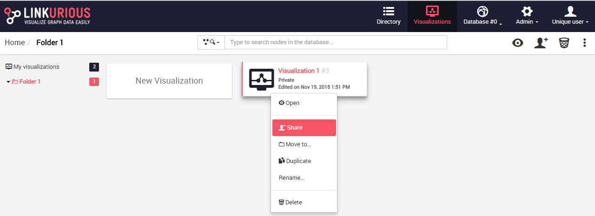
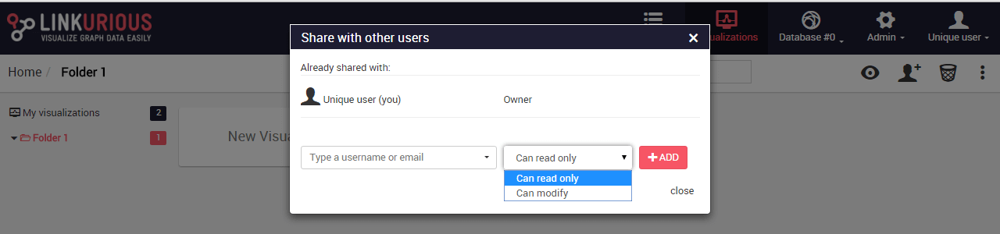

## Share

It is possible to share a visualization with another Linkurious Enterprise user. People we share a visualization with will be able to access it through the interface.
If we right-click on a visualization, we can share it as follows:



We click on the ```Share``` menu and type the username or email of the person we want to share the visualization with.




We can give read-only rights or allow modifications.
