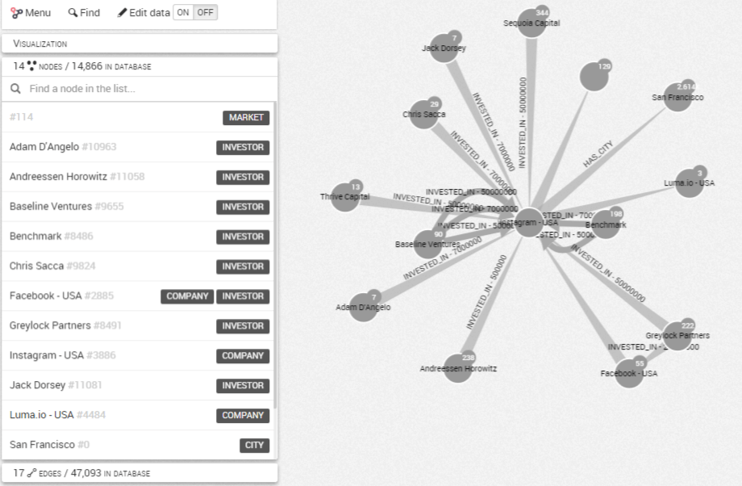
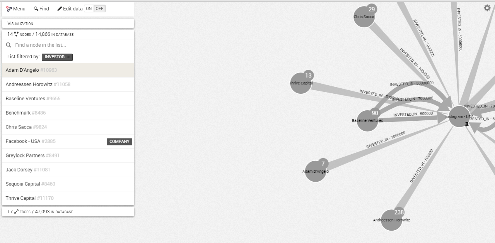

# List of nodes and edges in the graph

When we are working on a visualization, all the nodes and edges present in our graph are listed on the left panel of the Workspace. We can explore either the nodes or the edges of our graph going through the ```list```:



If we click on a node or a edge of the list, the camera will focus on it.
It is also possible to filter the results by category by clicking on the category we are interested in next to the name of the node or the edge.
We can also look for a particular node or edge by using the Finding bar:



Here we filter the list by the category ```Investor```, then we click on the node ```Adam D'Angelo```. The camera centers on this node.
