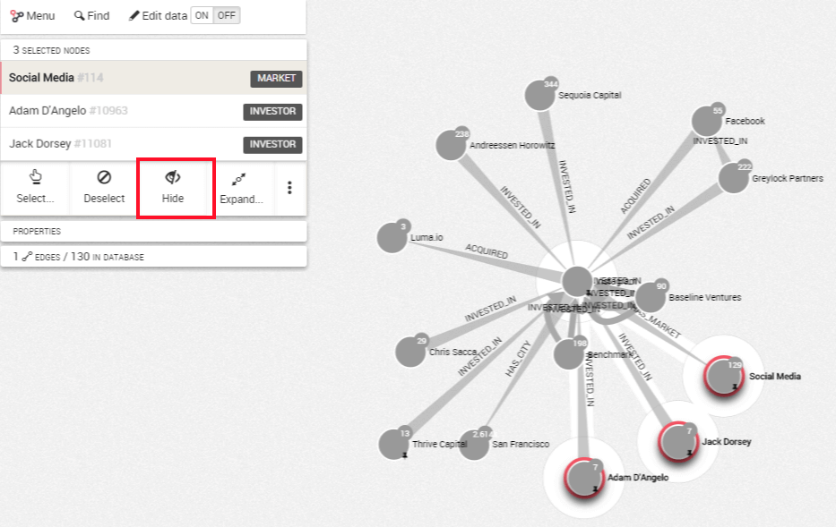
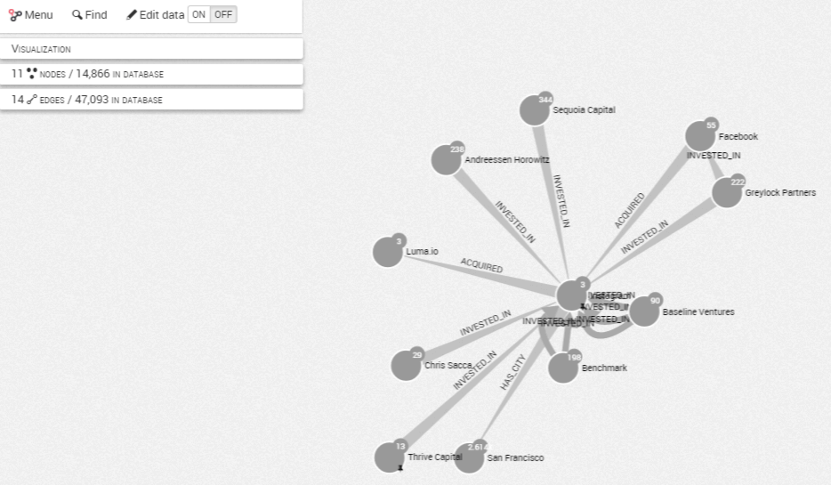

## Hide nodes and edges

Your visualization is getting too complex and you may want to remove from a visualization (i.e. hide) a few nodes or edges to make it easier to understand. Notice that hidden nodes an edges are not deleted from the database.

For example, in the picture above I have selected three nodes. I simply have to click on ```Hide``` to remove them from the visualization.



My three nodes are now removed from the visualization.




If we use the Toggle Lasso option to select the nodes we want to hide, we need to make sure the central node is not selected otherwise all the edges connected to this node will also be hidden.