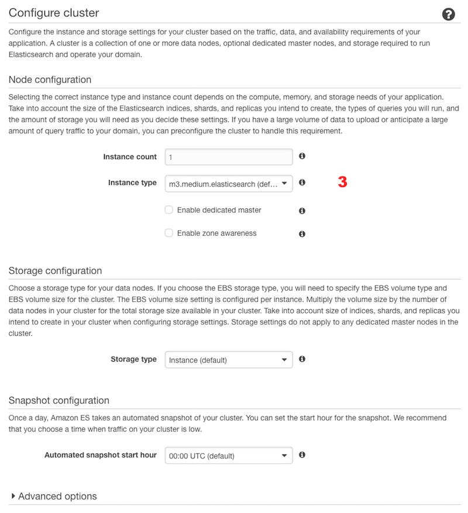
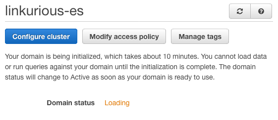
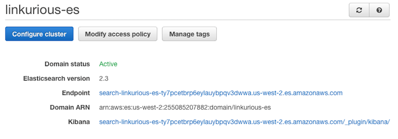

# Elasticsearch on AWS

By default, Linkurious ships with an embedded Elasticsearch instance which works out-of-the-box by default. The embedded Elasticsearch instance will work well for average to large database sizes, but for search-heavy use-cases or very large databases, configuring [your own ElasticSearch cluster](https://www.elastic.co/products/elasticsearch) might be necessary.

An easy way to deploy an easy-to-scale Elasticsearch cluster yourself is to use [Amazon Web Services](https://aws.amazon.com/) (AWS).

Please follow these steps to create a configure your AWS Elasticsearch cluster with Linkurious.

#### 1. Create your AWS account
Visit the [Amazon Web Services website](https://aws.amazon.com/) and create your account (or log in if you already have one).

#### 2. Create a new cluster
Visit the [Amazon Elasticsearch Service page](https://aws.amazon.com/elasticsearch-service/), log-in and follow the steps to create an Elasticsearch cluster:

##### a. Select "services" > "Elasticsearch Service"

<hr>
##### b. Hit "get started"

<hr>
##### c. Name your cluster <span style="color:red">`(1)`</span> and select the Elasticsearch version 2.x <span style="color:red">`(2)`</span>, hit "Next"

<hr>
##### d. Select the instance type, number of instances and number of dedicated masters in your cluster <span style="color:red">`(3)`</span>, depending on your database's size.

<hr>
##### e. Configure the access policy for your cluster. Use "access from specific IP" <span style="color:red">`(4)`</span> and enter the public IP address of your Linkurious server <span style="color:red">`(5)`</span> 

<hr>
##### f. Review your configuration and confirm the creation of the cluster.

<hr>
##### g. Wait until the cluster is deployed (usually less than an hour).

<hr>
##### h. When your cluster is deployed, copy the "Endpoint" host name

<hr>
##### i. Stop the Linkurious server
##### j. Open the Linkurious server's configuration file `linkurious/data/config/production.json` and edit the following fields:
```JavaScript
{
  // [...]
  "dataSources": [{
    "name": "My Graph DB",
    "graphdb": {
      // configuration or you graph database
    },
    "index": {
      "vendor": "elasticSearch2",
      // "Endpoint" value copied in step (h.)
      "host": "search-linkurious-es-ty7pcetbrp6eylauybpqv3dwwa.us-west-2.es.amazonaws.com",
      // AWS Elasticsearch instances listen to port 80 by default
      "port": 80,
      // other optional index configuration options
      "dynamicMapping": false,
      "skipEdgeIndexation": false
    }
  }]
  // [...]
}
```
<hr>
##### k. Restart Linkurious!