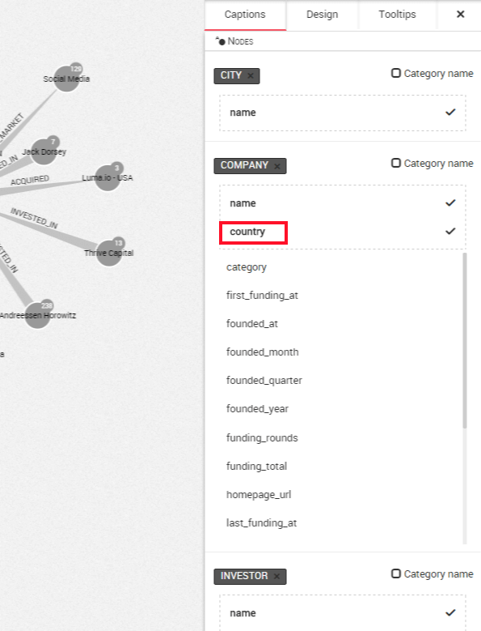
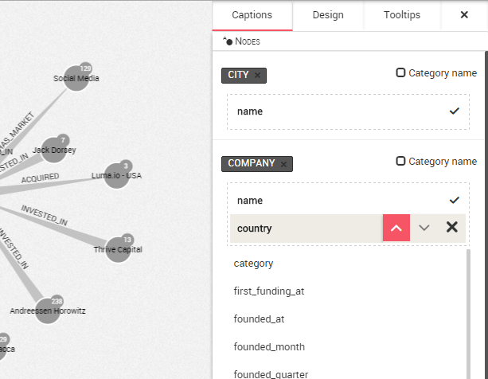

## Customize the captions

Linkurious Enterprise lets you choose which of the properties of your nodes and edges should be displayed on the canvas.

On the example below, only the ```names``` of the nodes are displayed by Linkurious Enterprise. In order to customize this, we need to open the ```design panel``` on the right.
 
On the ```Captions``` tab, we can see the different properties of the nodes in our graph. The ```name``` property is first. For example, we want to show the ```country``` in the visualization. To do it, we click on ```country``` and it will be added to the displayed properties listed in the dotted area.



The text displayed next to your node changes. Instead of  ```Instagram``` we have the information ```Instagram - USA```.

The same approach can be used for the edges, which panel is available below the panel of nodes.

<div class="alert alert-info">
Linkurious Enterprise will use the properties in the order it appears in the list. Placing the cursor on one property, we have the possibility to change the order or to remove a property. If a node doesn't have a property, Linkurious Enterprise will look for the next property, etc.
</div>

