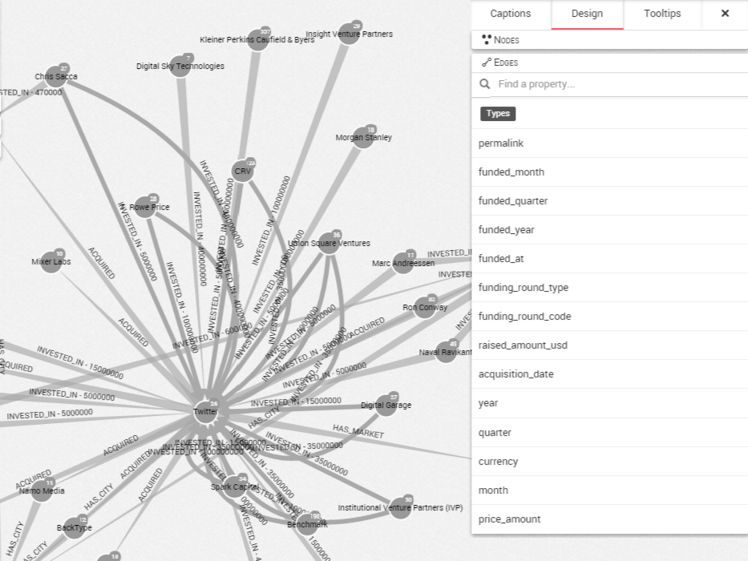
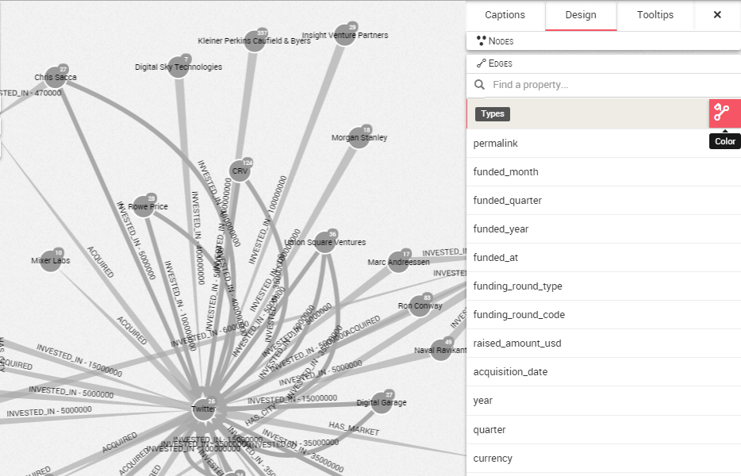

## Coloring the edges according to a property

Coloring the edges works exactly the same than coloring nodes as presented previously.

If all your edges have the same color, it is difficult to distinguish differences between them without looking at their individual properties. A great way to circumvent that issue is to choose to color the edges according to a certain property.

First of all, let's open the design panel on the right corner of the screen and hit the ```Design``` tab. We can see all edge properties. We click on the ```edges``` tab on the bottom.



We click on the ```color``` button along property ```type``` to color edges by this property.


We see:
* the different values associated with the ```type``` property (INVESTED_IN, ACQUIRED, HAS_CITY and HAS MARKET)
* how many occurences of each value there is (there are 39  nodes with the value ```INVESTED_IN```);
* which color is associated to which value (```ACQUIRED``` is blue)

To color the edges according to another property, we first unset colors by clicking on the same ```color``` button.



Then, we can click on the ```color``` button of another property.
