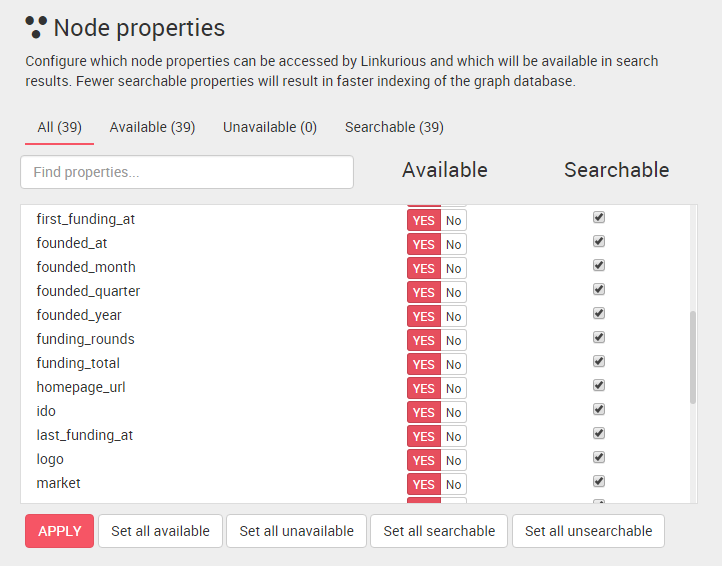

## Índice de búsqueda

Escoja qué propiedades de los nodos y relaciones serán utilizadas en resultados de búsqueda configurando el índice. Por defecto, Linkurious indexa todas las propiedades disponibles. Tenga en cuenta que propiedades no disponibles no son indexadas y por tanto no pueden encontrarse mediante el motor de búsqueda.

  Indexar menos datos recudirá el tiempo de indexación.

### Cambiar la lista de propiedades que se pueden buscar

Abra el panel de administración de datos, luego baje a la sección **Node properties** (propiedades de los nodos). Marque las propiedades que pueden buscarse.

Haga clic en el botón **Apply** (aplicar) cuando haya terminado.

Podemos configurar las propiedades de las relaciones de la misma forma en la sección **Edge properties**.

  Debemos re-indexar los datos para aplicar los cambios en los resultados de búsqueda.

