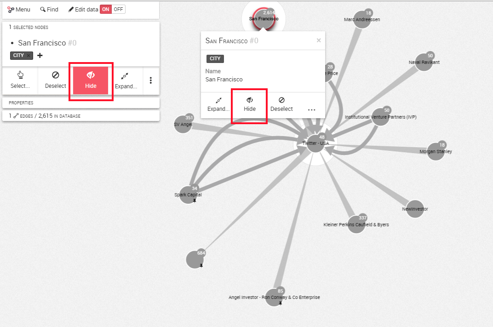
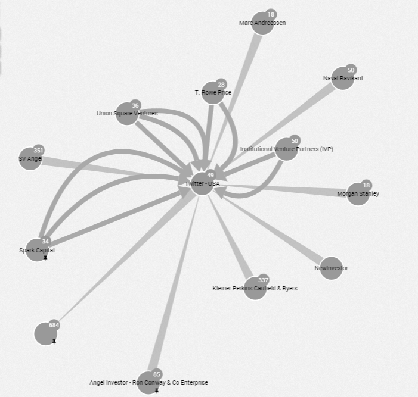
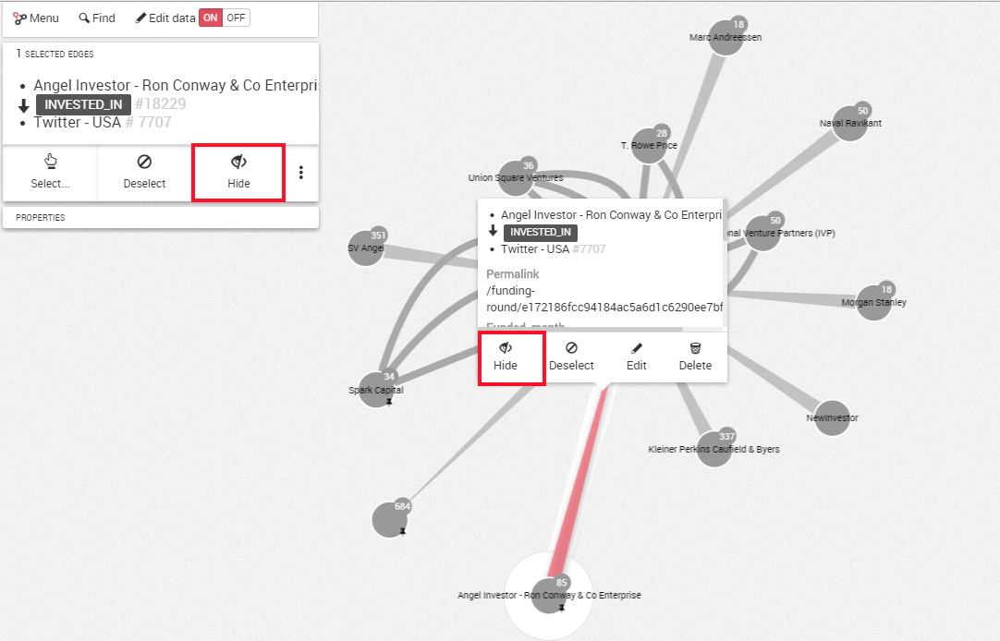
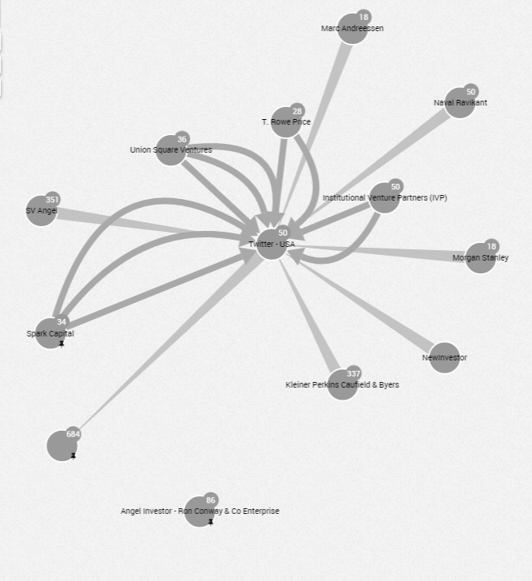

## Eliminar nodos y relaciones

###Eliminar un nodo

Si queremos eliminar un nodo de nuestra visualización, seleccionamos el nodo que queremos eliminar haciendo clic en él y luego hacemos una de las siguientes acciones:

- Pulsar en el botón ```Hide``` (ocultar) en el panel izquierdo
- Mediante clic derecho, también tenemos acceso al botón ```Hide```





###Eliminar una relación

Si queremos eliminar una relación de nuestra visualización, seleccionamos la relaciones que queremos eliminar haciendo clic en ella y luego hacemos una de las siguientes acciones:

- Pulsar en el botón ```Hide``` (ocultar) en el panel izquierdo
- Mediante clic derecho, también tenemos acceso al botón ```Hide```





