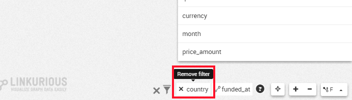
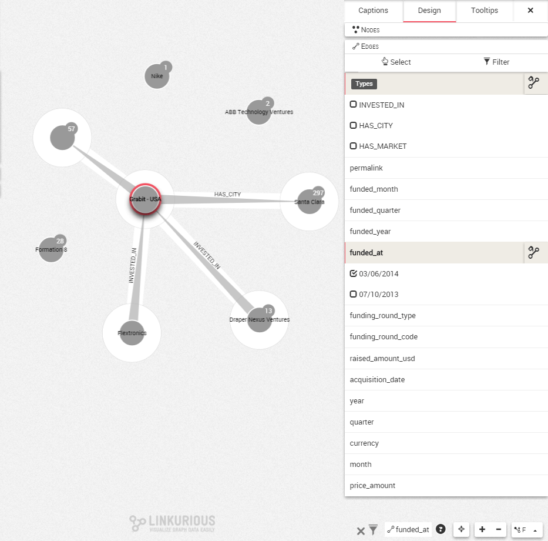

## Eliminar filtros

Hemos aplicado uno o varios filtros a nuestra visualización. Quizás fue un error o queremos volver al estado anterior. ¿Cómo eliminamos un filtro?

Por cada filtro que creamos un icono es añadido en la esquina inferior derecha de la pantalla. El primer filtro está a la derecha y el último a la izquierda.


En esta visualización, hay dos filtros. Los nodos están filtrados de acuerdo a la propiedad ```country``` (país). Las relaciones están filtradas de acuerdo a la propiedad ```funding_at``` (fecha de financiación).

Para eliminar el filtro en ```country```, hacemos clic en la cruz junto a su icono.



El filtro es eliminado de forma instantánea. Los nodos que ocultaba son devueltos a la visualización. El **otro** filtro sigue activo.

