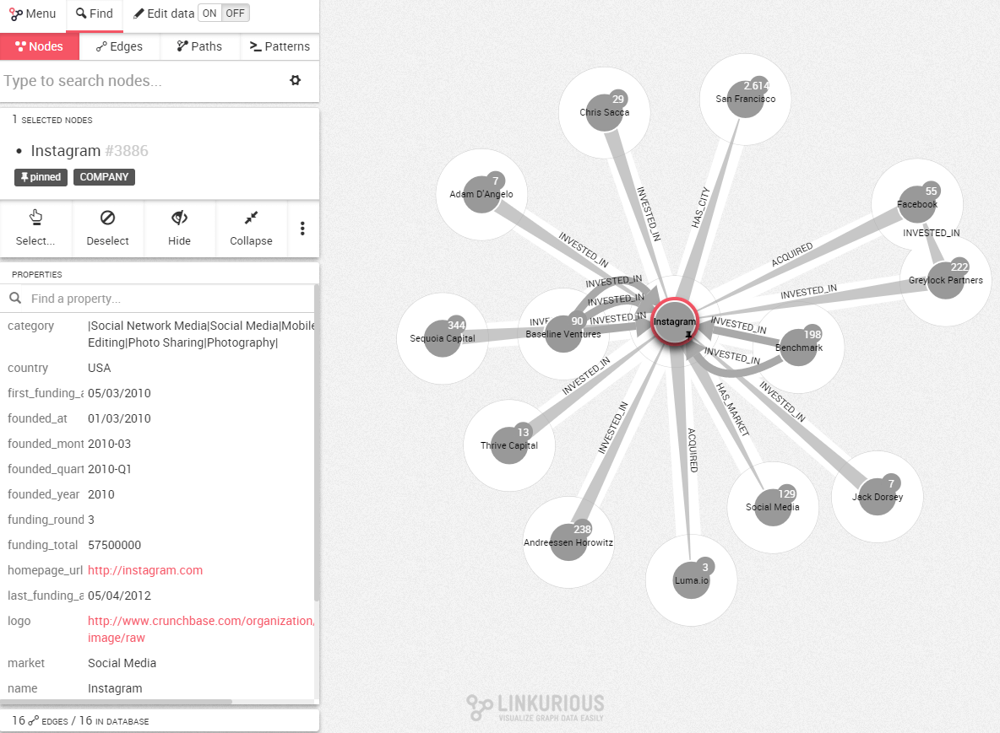

## Inspeccionar nodos

Para visualizar las diferentes propiedades de un nodo, hacemos clic en él. La información aparece inmediatamente en el lado izquierdo de la pantalla.


Aquí podemos ver que hay un nodo con el id ```#3886```. Se llama ```Instagram``` y tiene la categoría ```Company```. Debajo podemos ver varias propiedades asociadas a este nodo.

Por ejemplo el nodo tiene una propiedad ```country``` con el valor ```USA```.

Podemos desplazarnos hacia abajo para ver más propiedades o utilizar la barra de búsqueda para encontrar una propiedad.

Preste atención al número junto a cada nodo, es el número de relaciones no mostradas.

Si queremos ocultar el panel izquierdo, simplemente hacemos clic en ```PROPERTIES``` (círculo verde).

Inspeccione relaciones de la misma manera.

## Mostrar las conexiones de un nodo

Es momento de averiguar las relaciones de un nodo en particular. La forma más fácil de obtener esta información es hacer doble clic en el ```nodo``` en el que estamos interesados. En este caso estamos interesados en [Instagram](http://instagram.com/).


Ahora podemos ver todos los nodos que están conectados a Instagram.



¿Nota usted el halo blanco alrededor de cada nodo? Todos los nodos rodeados por el halo blanco están conectados al nodo actualmente seleccionado (o nodos seleccionados). En este caso, todos los nodos están conectados a Instagram.

Las aristas entre entre los nodos representan las relaciones. Todas las aristas tienen una dirección de un nodo (el que la base de la arista es grande) hacia otro (extremidad de la flecha).

Si hacemos clic en una ```relación```, las propiedades de esta relación serán mostradas en el panel izquierdo.

