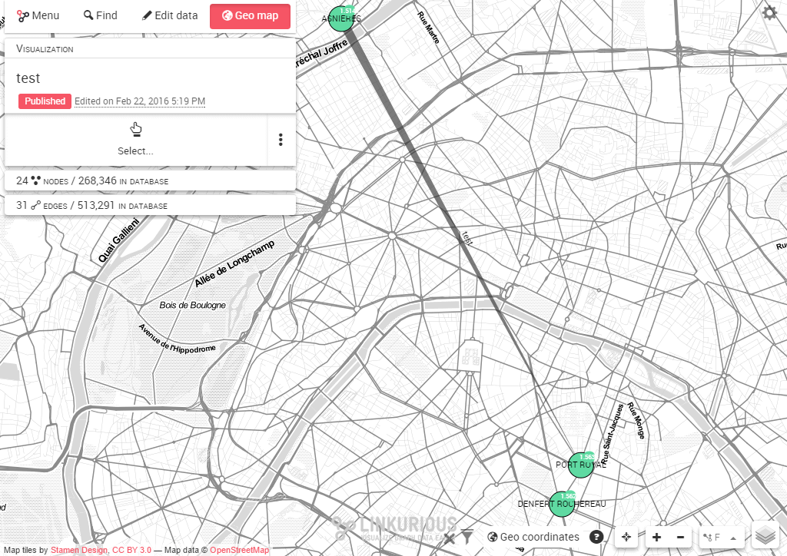
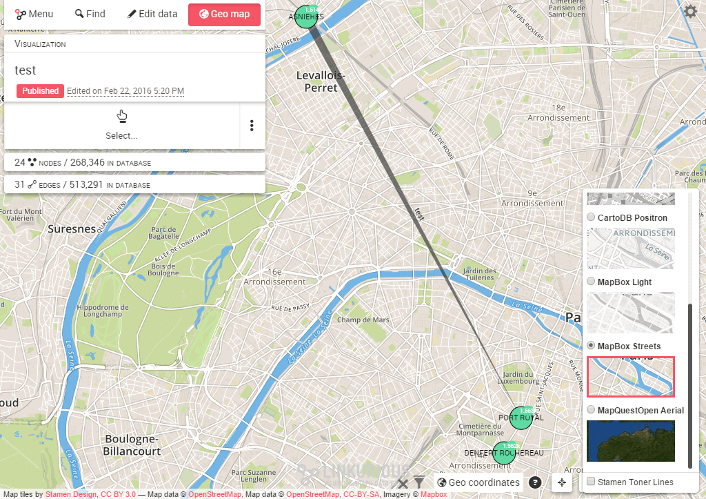
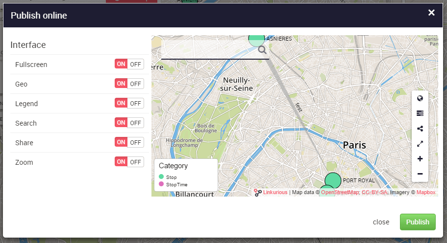

# Mostrar datos en un mapa geográfico

El botón para cambiar al modo geográfico está en el panel izquierdo del espacio de trabajo.
Podemos activar y desactivar el modo geográfico cuando queramos para cambiar entre la vista estándar de "red" y la vista geográfica.

Haga clic en él para mostrar el mapa geográfico. Los nodos son posicionados en el mapa de acuerdo a sus coordenadas geográficas. Otros nodos están ocultos por el filtro "geo coordinates".

Podemos aumentar y disminuir el zoom, arrastrar nodos en el mapa para mejorar la legibilidad, seleccionar nodos y relaciones, etc. Siempre podemos restablecer las coordenadas del nodo a su lugar original mediante el menú de acciones:

Si pasa el cursor por encima del icono de capas  en la parte inferior derecha del espacio de trabajo, se mostrará la lista de capas disponibles. Podemos escoger otro mapa base y añadir capas encima, dependiendo de las que estén disponibles en su instalación de Linkurious como puede verse utilizando el proveedor [Mapbox](https://www.mapbox.com/):

Finalmente, podemos publicar un widget interactivo desde **Workspace menu > Publish** con las capas geográficas. Vea el capítulo **Gestión > Publicar** para saber más.

