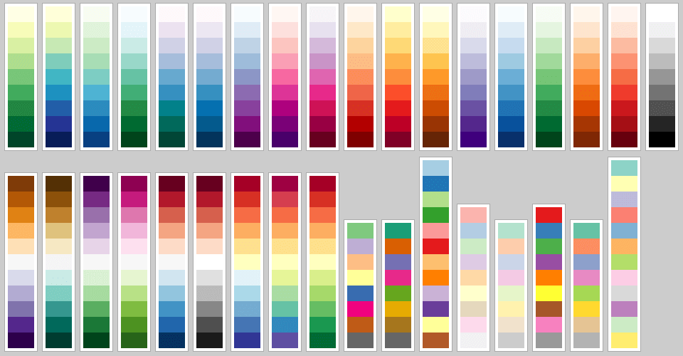

### Estilos de visualización

Usted puede configurar la instalación de Linkurious Enterprise para personalizar el aspecto visual predeterminado de los nodos y relaciones en nuevas visualizaciones, de forma que sus usuarios se lanzarán directamente a la exploración de los datos. Los nodos y relaciones son de color gris y tienen el mismo tamaño por defecto. Los estilos definidos se aplicarán a **todas** las fuentes de datos.

Abra el archivo de configuración `linkurious/data/config/production.json`. Los estilos de visualización están definidos dentro de la sección `sigma` mediante las claves `styles` y `palette`. Los estilos son asignaciones entre variables visuales como el color y el tamaño, y propiedades de datos de nodos o relaciones. Las variables visuales pueden ser usadas en un único estilo a la vez. Por ejemplo, podemos establecer `nodes.color` y `nodes.icons`, pero no podemos establecer `nodes.color` dos veces. Sí que podemos establecer `nodes.color` y `edges.color`.

Las paletas pueden contener esquemas de colores para propiedades tanto cuantitativas como cualitativas, así como esquemas para iconos. Los esquemas para propiedades cualitativas asignan diferentes valores a diferentes colores. Los esquemas para propiedades cuantitativas relacionan el valor numérico de una propiedad a listas secuenciales de colores. Los esquemas pueden ser anidados y referenciados con notación de puntos por los estilos.

Los valores disponibles para `styles.nodes.by` son:
- "data.categories"
- "data.properties.X", siendo "X" el nombre de la propiedad.

Los valores disponibles para `styles.edges.by` son:
- "data.type"
- "data.properties.X", siendo "X" el nombre de la propiedad.

#### Asignación de colores

En el siguiente ejemplo, los nodos son coloreados por las categorías "COMPANY", "CITY", "MARKET" e "INVESTOR", y las relaciones son coloreadas por los tipos "HAS_CITY", "HAS_MARKED" e "INVESTED_IN". Preste atención a cómo se referencia cada paleta de colores en los esquemas.

**Ejemplo para propiedades cualitativas:**
```json
"styles": {
  "nodes": {
    "color": {
      "by": "data.categories",
      "scheme": "nodes.qualitative.categories"
    }
  },
  "edges": {
    "color": {
      "by": "data.type",
      "scheme": "edges.qualitative.type"
    }
  }
},
"palette": {
  "nodes": {
    "qualitative": {
      "categories": {
        "INVESTOR": "#5FDAA2",
        "COMPANY": "#DE6FBC",
        "MARKET": "#4EA4D4",
        "CITY": "#D4742C"
      }
    }
  },
  "edges": {
    "qualitative": {
      "type": {
        "INVESTED_IN": "#5FDAA2",
        "HAS_CITY": "#DE6FBC",
        "HAS_MARKET": "#4EA4D4"
      }
    }
  }
}
```

Colorear mediante propiedades cuantitativas sigue la misma logica. En el siguiente ejemplo los nodos son coloreados por una propiedad numérica. Los valores serán agrupados linealmente en 7 contenedores, ordenados de menor a mayor (ver ejemplo debajo).


**Ejemplo para propiedades cuantitativas:**
```json
"styles": {
  "nodes": {
    "color": {
      "by": "data.properties.my_score",
      "scheme": "nodes.quantitative"
    }
  }
},
"palette": {
  "nodes": {
    "quantitative": {
      7: ['#161344','#3f1c4c','#632654','#86315b','#a93c63','#cd476a','#f35371']
    }
  }
}
```

#### Paletas de colores

Linkurious siempre usará 7 colores para propiedades cuantitativas de los nodos, y solamente 3 colores para las relaciones. El ojo humano solamente puede distinguir unos pocos colores, de forma que usted debería diseñar sus paletas con cuidado.

Si usted no asigna estilos para propiedades cualitativas, Linkurious asignará colores a partir de un conjunto de colores generado aleatoriamente (pero cuidadosamente). Este conjunto puede ser modificado en `palette.nodes.qualitative.linkurious_def` (y las relaciones respectivamente).

Tenga cuidado de nunca borrar `linkurious_def` o `sequential` porque son utilizadas por Linkurious.

Nosotros recomendamos escoger colores de [la paleta ColorBrewer](https://github.com/Linkurious/linkurious.js/blob/develop/plugins/sigma.plugins.colorbrewer/sigma.plugins.colorbrewer.js), que proporciona conjuntos de colores altamente distintivos (ver debajo).



Usted también puede generar escalas de color consistentes para datos cualitativos en http://gka.github.io/palettes/ .

#### Iconos de nodos

Linkurious proporciona más de 500 iconos del proyecto FontAwesome. Usted puede asignar iconos utilizando sus carácteres unicode tales como "\uf219". Obtenga la lista completa de carácteres en http://fortawesome.github.io/Font-Awesome/icons/ (seleccione un icono para mostrar su carácter unicode).

El siguiente ejemplo establece iconos para las categorías de nodo "COMPANY", "CITY", "MARKET" e "INVESTOR".

**Ejemplo**
```json
"styles": {
  "nodes": {
    "icon": {
      "by": "data.categories",
      "scheme": "nodes.icons.categories"
    }
  }
},
"palette": {
  "nodes": {
    "icons": {
      "categories": {
        "INVESTOR": {"font": "FontAwesome", "scale": 1, "color": "#fff", "content": "\uf19c"},
        "CITY": {"font": "FontAwesome", "scale": 1, "color": "#fff", "content": "\uf015"},
        "COMPANY": {"font": "FontAwesome", "scale": 1, "color": "#fff", "content": "\uf135"},
        "MARKET": {"font": "FontAwesome", "scale": 1, "color": "#fff", "content": "\uf219"}
      }
    }
  }
}
```

#### Imágenes de nodos

*Esta característica es experimental y todavía no está disponible desde la interfaz de usuario.*

Los nodos pueden ser representados con una imagen si alguna de sus propiedades contiene la URL a una imagen. Los formatos disponibles son PNG, JPG, GIF o TIFF. El siguiente ejemplo establece imágenes para las categorías de nodo "COMPANY", "CITY" y "MARKET".


**Ejemplo**
```json
"styles": {
  "nodes": {
    "image": {
      "by": "data.categories",
      "scheme": "nodes.images"
    }
  }
},
"palette": {
  "nodes": {
    "images": {
      'COMPANY': {
        url: 'http://example.com/img/company.png', scale: 1.3, clip: 0.85
      },
      'CITY': {
        url: 'http://example.com/img/city.png', scale: 1.3, clip: 0.85
      },
      'MARKET': {
        url: 'http://example.com/img/market.png', scale: 1.3, clip: 0.85
      }
    }
  }
}
```
