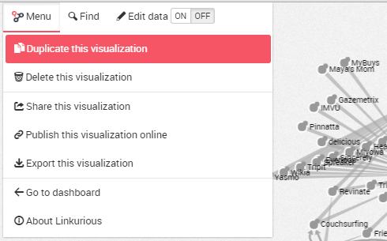

# Duplicar

Es posible duplicar una visualización. Esta característica podría ser útil cuando queremos probar nuevas cosas en nuestra visualización y mantener un registro de la última versión, de forma que el duplicado es usado como un borrador.


## Desde el panel de control

Es posible duplicar una visualización guardada desde el panel de control de la siguiente forma:


Después hacemos clic en ```Duplicate``` y se mostrará una copia de nuestra visualización accesible directamente desde el panel de control:


## Desde el espacio de trabajo

También es posible duplicar una visualización guardada desde el espacio de trabajo mediante el Menú:



Posteriormente el duplicado es accesible desde el panel de control.

Tenga en cuenta que al duplicar desde el espacio de trabajo, estaremos cambiando directamente al duplicado para trabajar en él.

<div class="alert alert-info">
    Es posible duplicar una visualización compartida con usted por otro usuario.
</div>

<div class="alert alert-info">
    Si un usuario ha compartido una visualización con usted pero no tiene permitido modificarla, duplique esta visualización. Usted será capaz de modificar la copia.
</div>

