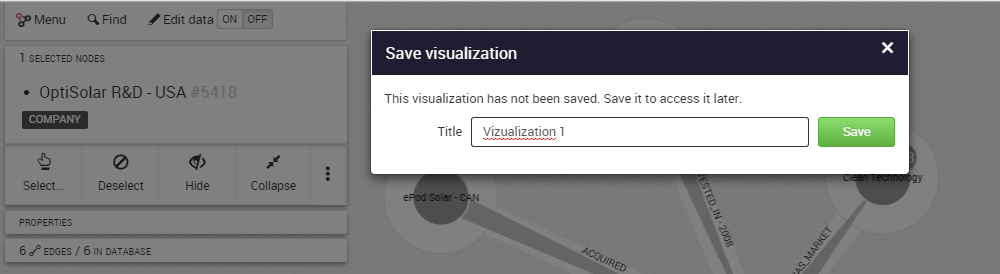

## ¿Cómo funciona el autoguardado?

Cuando estamos trabajando en una visualización, podemos guardarla mediante el botón Menú y luego haciendo clic en SAVE (guardar). En adelante, las modificaciones serán guardadas de forma automática.

Podemos acceder a una visualización guardada mediante el panel de control de Linkurious Enterprise.

