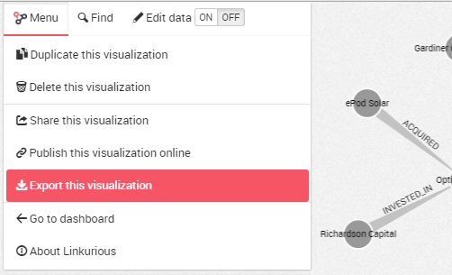

## ¿Cómo exportar una visualización?

Hemos creado una visualización y queremos compartir o modificar su contenido. Abrimos el menú del espacio de trabajo y después hacemos clic en el botón ```Export```.



Los datos de la visualización pueden exportarse en los siguientes formatos:

* Excel 2007+ workbook
* CSV
* GEXF - compatible con [Gephi](https://gephi.github.io/)
* GraphML
* JSON
* PNG
* SVG (beta) - compatible con Inkscape y Adobe Illustrator para editar


Después de hacer clic en un formato, el archivo es descargado automáticamente por su navegador web.

La exportación a PNG creará una imagen del grafo completo incluso aunque estemos haciendo zoom en un área específica en este momento. Aquí un ejemplo:


La exportación a PNG es configurable: establecer el ratio de zoom en la visualización exportada desde 1 (alejar) hasta 0.2 (acercar) no solo adaptará el tamaño de la imagen, también tendrá influencia en la cantidad de información mostrada de la misma forma que ocurre en la pantalla.

<div class="alert alert-info">
    Esta característica es diferente del botón Take Screenshot (tomar captura de pantalla) disponible haciendo clic derecho en el espacio de trabajo o desde el menú de acciones: crea una imagen solamente del área de pantalla mostrada actualmente.
</div>