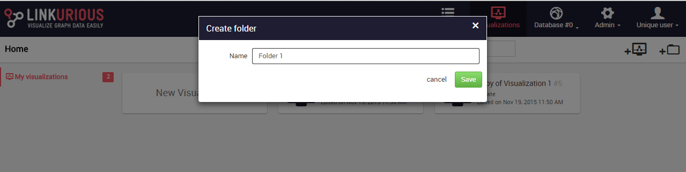
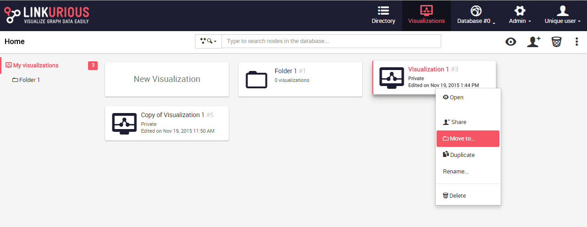

## Organizar visualizaciones

Las visualizaciones son añadidas por defecto al panel de control. Desde el panel de control podemos borrar, renombrar o abrir una visualización.

También podemos organizar las visualizaciones en carpetas.

### Abrir, renombrar o borrar una visualización

Las siguiente acciones son posibles cuando hacemos clic derecho en una visualización o en el menú derecho del panel de control
* open: Abre la visualización donde usted la dejó (con los colores, tamaños y filtros)
* share: comparte la visualización
* move to: mueve la visualización a una carpeta
* duplicate: duplica la visualización
* rename: cambia el nombre de la visualización
* delete: borra la visualización


### Ordenar las visualizaciones en carpetas

Para crear una carpeta, podemos hacer clic derecho en el fondo del panel de control o pulsar  ```Create folder``` (crear carpeta) en el menú de la derecha.


Introducimos el nombre de nuestra carpeta.



Pulsamos```Save``` (guardar). Nuestra carpeta es creada.


Abrimos la carpeta haciendo clic en ella. Si queremos mover una visualización a la carpeta utilizamos la acción ```move to``` (mover a) cuando hacemos clic derecho en nuestra visualización: 



Seleccionamos la carpeta a la que queremos mover nuestra visualización:


La visualización ha sido movida a la carpeta.

