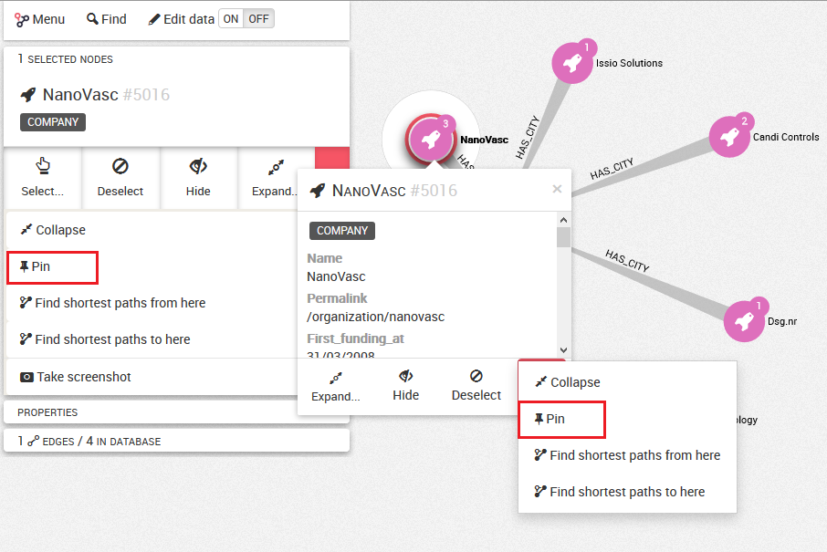
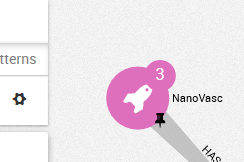
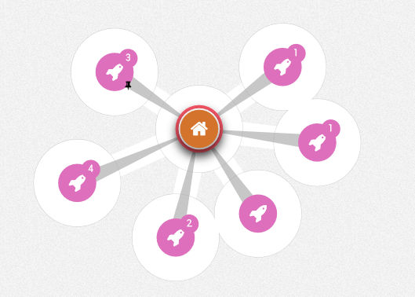
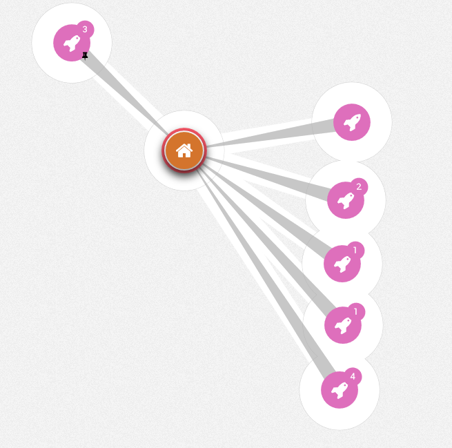

# Fijar los nodos

Es posible fijar nodos en nuestra visualización.
Fijar un nodo permite mantenerlo en un lugar específico del grafo.

Para fijar un nodo podemos hacer clic en el botón ```Pin``` (fijar) del panel izquierdo o hacer clic derecho en un nodo y después seleccionar el botón ```Pin```.



El símbolo de un pin aparece en el nodo.



SI fijamos un nodo, este nodo permanecerá en el mismo lugar cuando movamos el resto del grafo, por ejemplo al utilizar la disposición mediante un algoritmo dirigido por fuerzas (ver Manipulación):

  