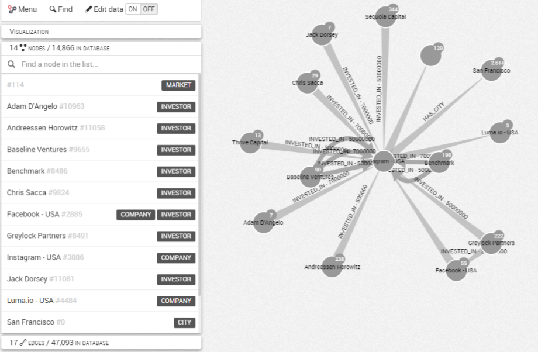
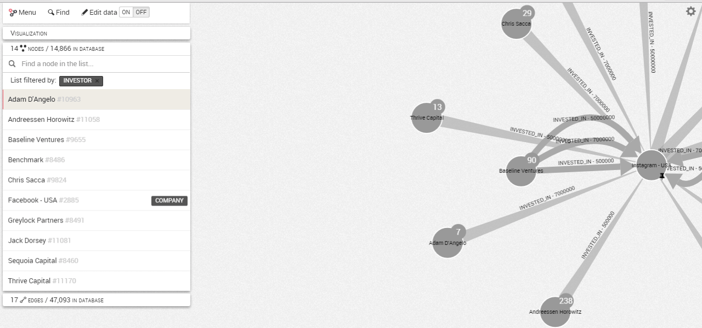

# Lista de nodos y relaciones en el grafo

Cuando estamos trabajando en una visualización, todos los nodos y relaciones presentes en nuestro grafo están listadas en el panel izquierdo del espacio de trabajo:


Podemos entonces explorar los nodos o relaciones del grafo recorriendo la ```lista```:



Si hacemos clic en un nodo o relación de la lista, la cámara se enfocará en él.
También es posible filtrar los resultados por categoría haciendo clic en la categorías que nos interese junto al nombre del nodo o relación.
Además podemos buscar un nodo relación en particular utilizando la barra de búsqueda:



En este caso filtramos la lista a la categoría ```Investor``` (inversor), después hacemos clic en el nodo ```Adam D'Angelo```. La cámara se centra en este nodo.
