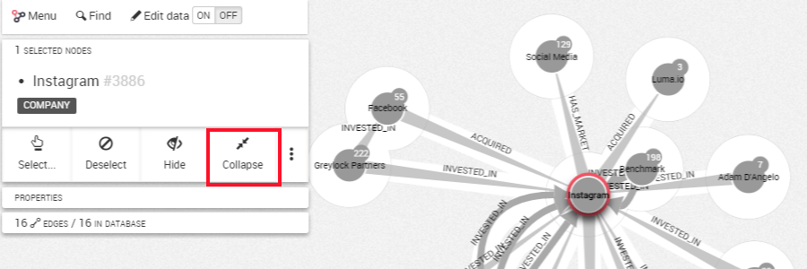

## Reducir nodos

A medida que exploramos el grafo, expandimos las relaciones de uno o múltiples nodos. A veces los nodos y relaciones añadidos a nuestra visualización podrían no ser relevantes. En ese caso, podemos usar la funcionalidad de reducción para eliminarlos.

Reducir significa eliminar de la visualización los nodos que están conectados a un nodo o grupo de nodos.

Imaginemos que estamos viendo las relaciones de Instagram.
Necesitamos seleccionar el nodo Instagram para acceder al botón de ```Collapse``` (reducir).



Entonces seleccionamos ```Collapse```. Los nodos conectados a Instagram se eliminan de la visualización.


> ¿Ha notado usted que dos nodos permanecen en la vista después de la reducción? Están enlazados a Instagram **y** enlazados entre ellos. En ese caso Linkurious Enterprise los mantendrá en su visualización.
