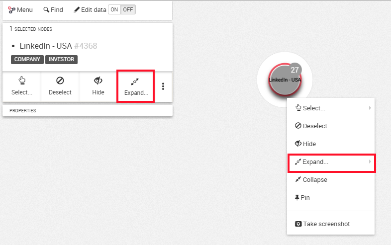
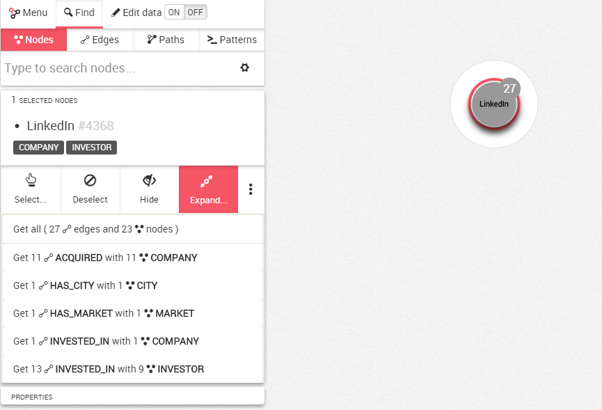
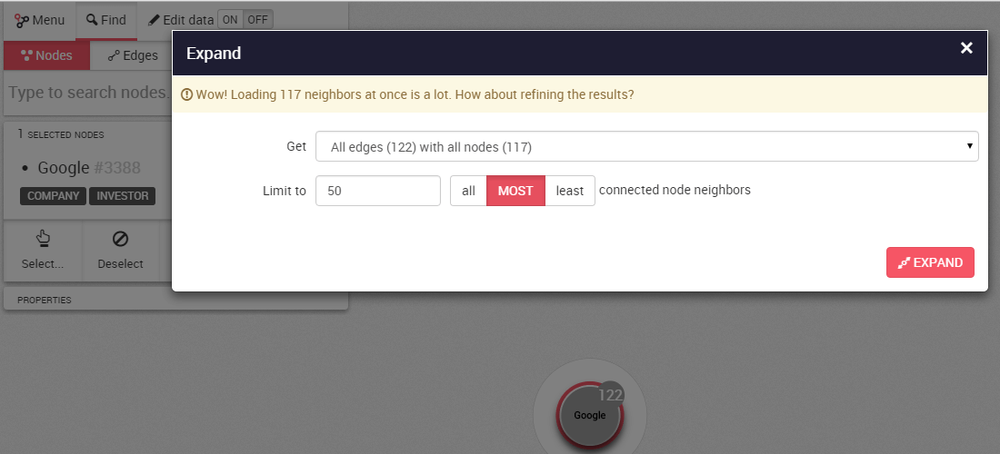

## Expandir nodes

Expandir nodos significa mostrar los nodos que estén conectados a un nodo o grupo de nodos.

Podemos expandir nodos de formas diferentes:

* Doble clic en un nodo de la vista.
* Seleccionar uno o más nodos, luego hacer clic en el botón ```Expand``` del panel izquierdo.
* Clic derecho en un nodo de la vista, luego clic en el botón ```Expand``` del menú contextual.



El botón ```Expand``` del panel izquierdo muestra la lista de tipos de relaciones y categorías de nodos vecinos disponibles. Podemos elegir obtener todos o filtrar las relaciones y vecinos devueltos.



Si los nodos expandidos tienen demasiados vecinos, podría llevar a una visualización ilegible.

Linkurious previene que añadamos demasiados vecinos a la vez pidiendo filtrar los vecinos obtenidos. Un diálogo aparecerá, que ofrece opciones para seleccionar un tipo de relación específica y categoría de vecinos, escoger los vecinos más o conectados o menos conectados y cambiar el número máximo de vecinos obtenidos. Podemos saltarnos este límite manualmente.



> Es tentador añadir siempre más nodos y relaciones a su visualización. Pero tenga en cuenta que si no es cuidadoso podría terminar con demasiados nodos en su pantalla... y una visualización inservible.

> Para evitar esto, siempre recuerde pensarlo dos veces antes de añadir más información a su visualización. ¡Los filtros y la funcionalidad de ocultar están para ayudar!
