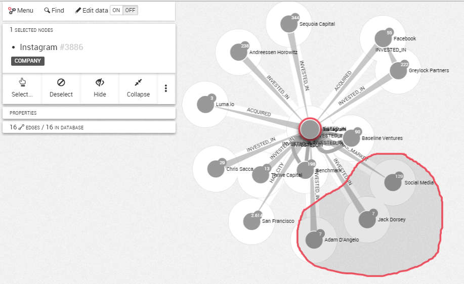
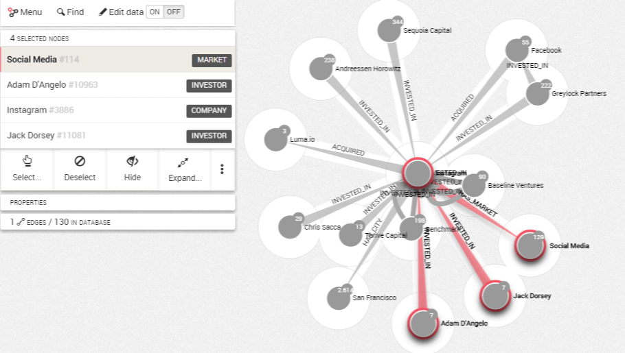

## Utilizando el lazo

Es posible seleccionar los lodos en un área particular de su visualización. Para ello, Linkurious Enterprise proporciona un lazo.

Para hacerlo, escoja ```Select``` (seleccionar) en el panel de información de la izquierda. 
Seleccione ```Toggle lasso``` (activar/desactivar lazo).
Mueva el lazo alrededor de los nodos que le interesen para seleccionarlos.



Suelte el ratón cuando haya acabado, y su selección se activará.


