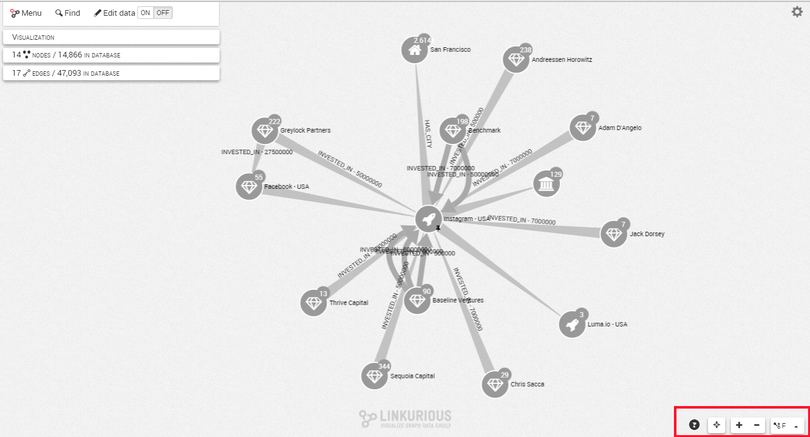
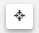
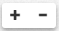
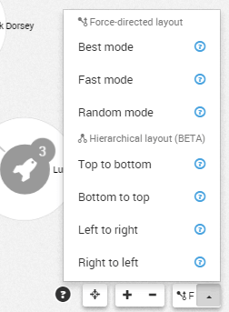
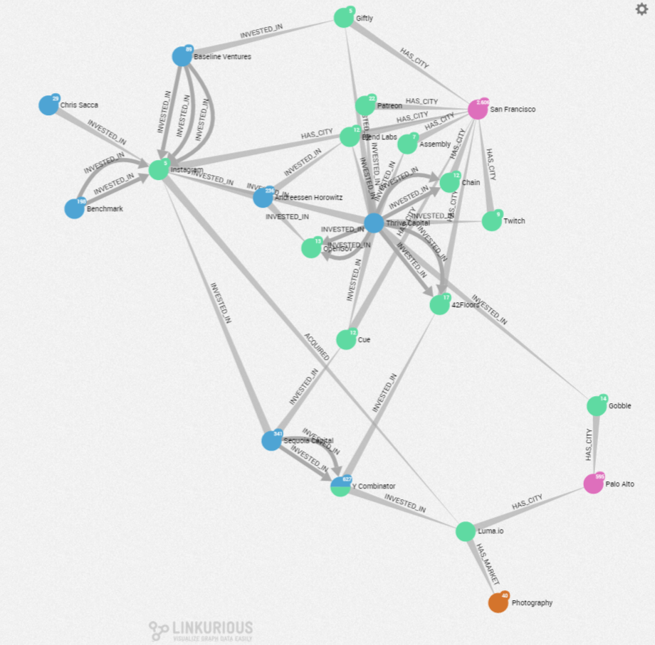
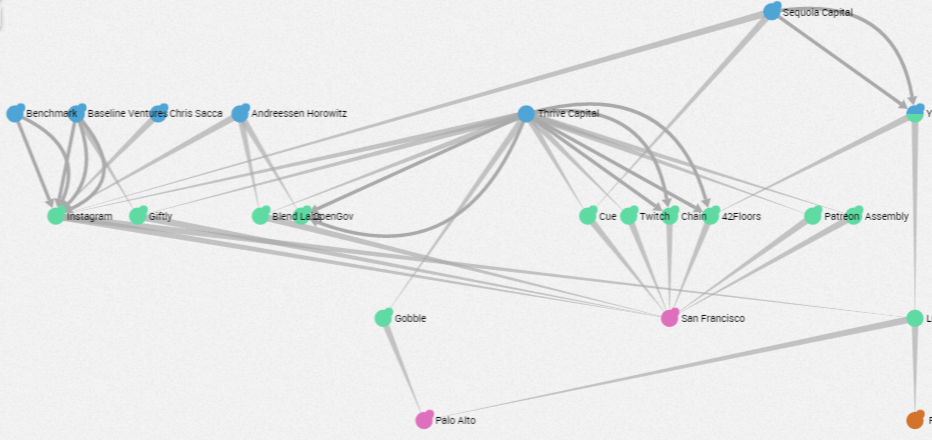
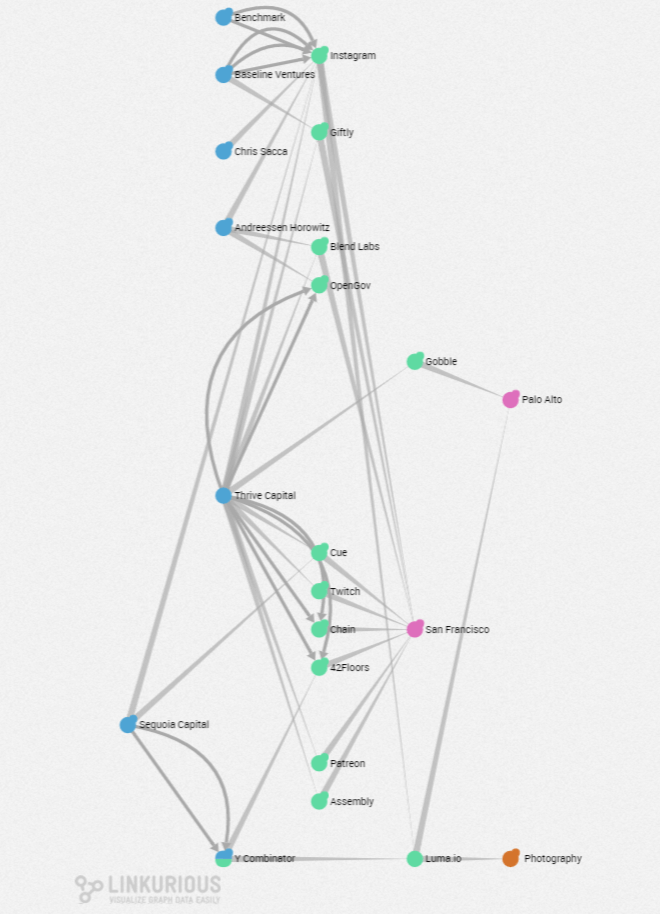

## Disposición

### Controles de visualización

En el espacio de trabajo, varios controles están disponibles en la esquina inferior derecha de la pantalla:



- El botón de ```shortcuts``` (atajos): , le da acceso a una lista de atajos para explorar e interactuar con el grafo.
- El botón ```Locate``` (localizar)  centra el grafo en la pantalla.
- El botón ```Zoom In/Zoom Out``` (aumentar/disminuir zoom)  aumenta o disminuye el zoom de nuestro grafo.
- El botón ```Layout``` (disposición) nos da varias opciones para organizar nuestro grafo.

Hacer clic en el botón de disposición aplicará el algoritmo de disposición (layout) actualmente seleccionado, que por defecto es un algoritmo rápido dirigido por fuerzas. Dos categorías de algoritmos de disposición están disponibles: dirigidos por fuerzas (force-directed) y jerárquicos (hierarchical). Están disponibles en varios modos:



### Force-directed layout (algoritmo de disposición dirigido por fuerzas)

Estos tipos de algoritmos posicionan los nodos de acuerdo a sus conexiones: los nodos conectados normalmente son posicionados juntos, mientras que los nodos desconectados generalmente son alejados.

**Best Mode (mejor modo):**
toma el que más tiempo para calcular las posiciones de los nodos pero proporciona mejores resultados que el modo rápido.



**Fast Mode (modo rápido, predeterminado):**
calcula las posiciones de los nodos rápidamente pero algunos nodos podrían quedar superpuestos.

**Random Mode (modo aleatorio):**
las posiciones de los nodos son distribuidas al azar antes de calcular las nuevas posiciones de los nodos.

### Hierarchical layout (algoritmo de disposición jerárquico)

Estos tipos de algoritmos organizan los nodos en diferentes capas de forma automática alineando cada capa de forma vertical u horizontal. Los nodos raíz son detectados automáticamente.

**Top to bottom Mode (modo de arriba a abajo):**
posicionará los nodos raíz en la parte superior de la pantalla.



**Left to Right Mode (modo izquierda a derecha):**
posicionará los nodos raíz en el lado izquierdo de la pantalla.



**Bottom to top Mode (modo de abajo a arriba):**
posicionará los nodos raíz en la parte inferior de la pantalla.

**Right to left Mode (modo derecha a izquierda):**
posicionará los nodos raíz en el lado derecho de la pantalla.