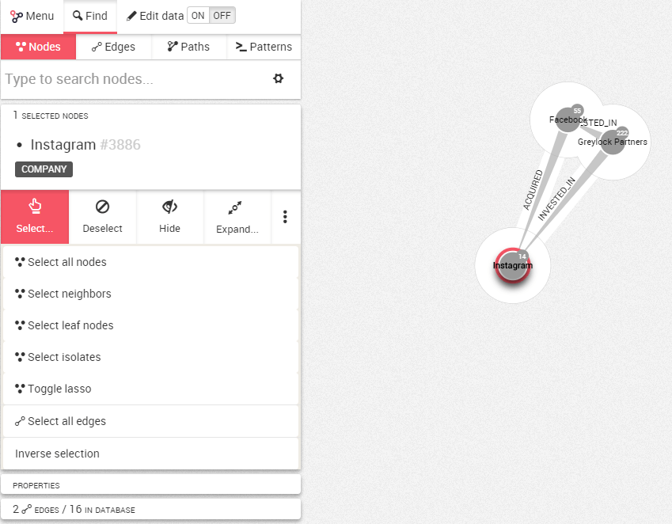

## Seleccionar nodos y relaciones

La forma más sencilla de seleccionar un nodo o relación es simplemente hacer clic en él. También es posible seleccionar múltiples nodos a la vez.

Para hacerlo, escoja ```Select``` (seleccionar) en el panel de información de la izquierda.



Ahora tiene unas pocas opciones:

* ```Select all nodes``` : seleccionar todos los nodos de su visualización
* ```Select neighbors``` : seleccionar los vecinos del nodo seleccionado en ese momento
* ```Select leaf nodes``` : Seleccionar los nodos de su visualización que solamente tienen una relación
* ```Select isolates``` : seleccionar los nodos de su visualización que no tienen ninguna relación
* ```Select all relationships``` : seleccionar todas las relaciones de su visualización
* ```Toggle lasso``` : seleccionar manualmente los nodos que nos interesan
* ```Select all edges``` (seleccionar todas las relaciones)
* ```Inverse selection``` : invertir su selección actual

También existen atajos para estas acciones. Estos atajos son presentados en la sección ```Manipulación > Atajos```.