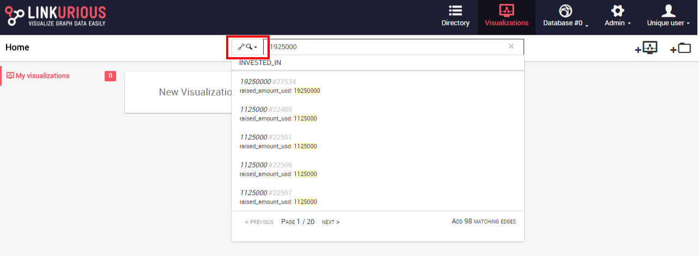
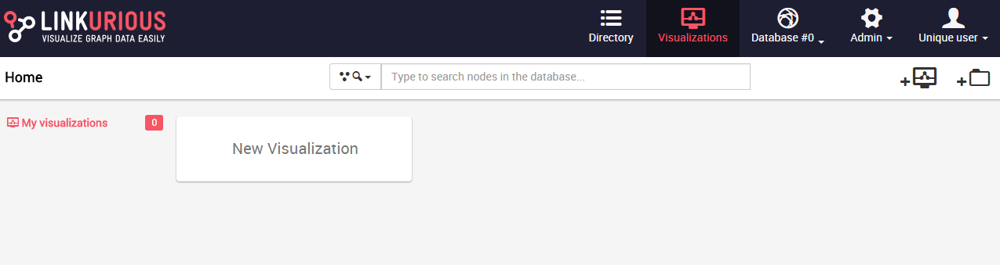
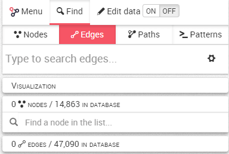
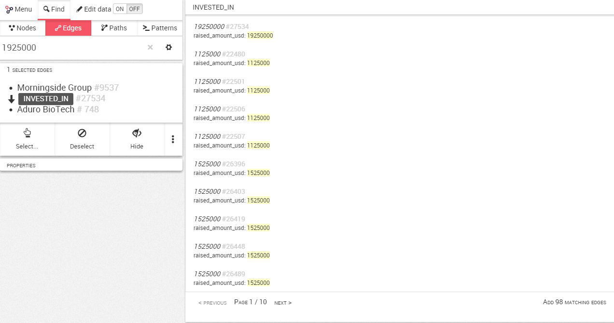
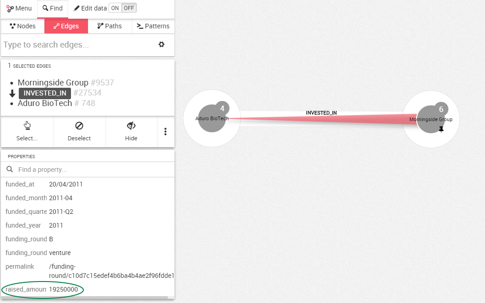

## Buscar relaciones

Podríamos tener millones de relaciones en nuestro grafo. ¿Qué ocurre si queremos mirar una relación en particular?

La primera posibilidad es utilizar la barra de búsqueda rápida desde el panel de control, donde podemos escoger buscar nodos o relaciones (rectángulo rojo). En este caso buscamos relaciones:



La segunda posibilidad es utilizar la barra de búsqueda en el espacio de trabajo una vez que hayamos creado una nueva visualización.



Por defecto el buscador inicialmente busca nodos. Para buscar una relación, hacemos click en la pestaña ```Edges``` (relaciones).



La búsqueda de relaciones funciona de la misma forma que la búsqueda de nodos.

Simplemente escribimos lo que queremos buscar y vemos la lista de sugerencias que coinciden con nuestra búsqueda.



En los resultados de búsqueda, podemos ver que hay una relación que tiene el valor ```1925000``` en la propiedad ```raised_amount_usd``` (cantidad de dólares recaudada).

Hacemos clic en el resultado que elijamos, y será añadido al área de trabajo. Ahora podemos visualizarlo.



