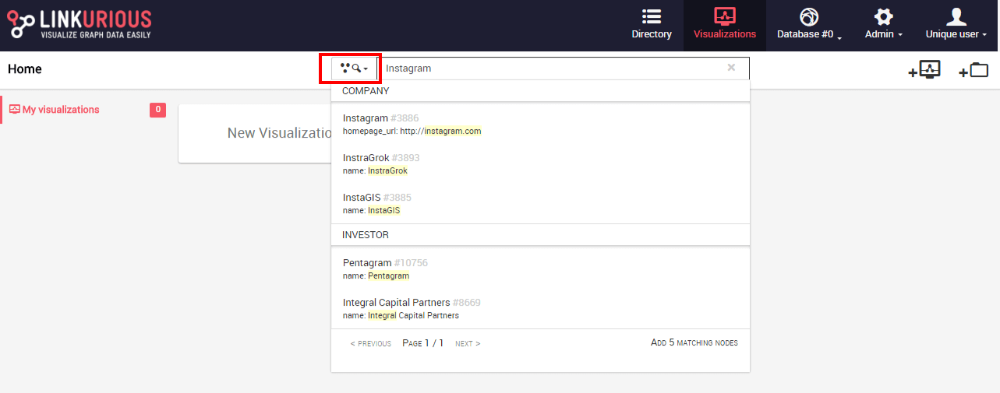
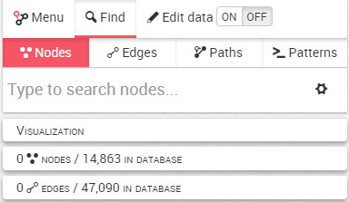
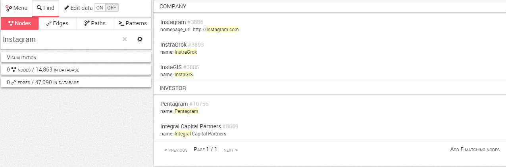
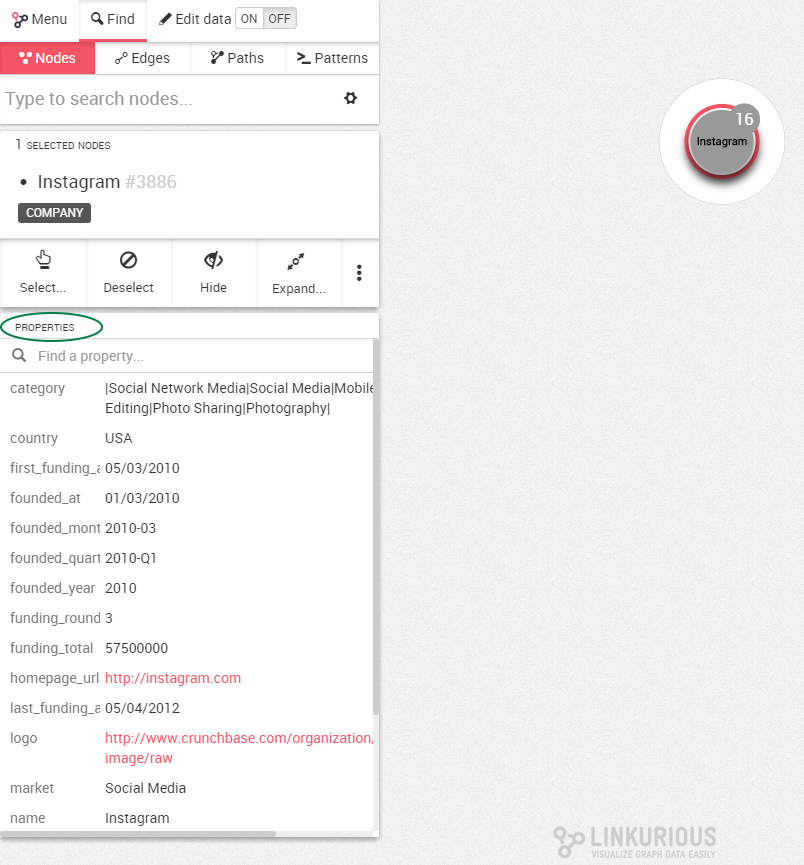

## Buscar nodos

Podríamos tener millones de nodos en nuestro grafo. ¿Qué ocurre si queremos mirar un nodo en particular?

La primera posibilidad es utilizar la barra de búsqueda rápida desde el panel de control, donde podemos escoger buscar nodos o relaciones (rectángulo rojo). En este caso buscamos nodos:



La segunda posibilidad es utilizar la barra de búsqueda en el espacio de trabajo una vez que hayamos creado una nueva visualización.



Podemos buscar un nodo escribiendo el nombre de cualquiera de sus propiedades. Aquí, por ejemplo, buscamos la propiedad ```Instagram```. Podemos ver la lista de sugerencias que se ajustan a nuestra búsqueda.



Todas las entradas de la base de datos que contengan la palabra ```Instagram```aparecerán. Estos resultados están agrupados por categoría y ordenados por relevancia.

En cada resultado podemos ver:
- El nombre del nodo y su ID numérico generado por la base de datos (```Instagram, #3886```)
- La propiedad que coincide con nuestra búsqueda, resaltada en amarillo (aquí, el enlace de la empresa ```Instagram``` contiene el texto ```Instagram``` que coincide con nuestra búsqueda)

Hacemos clic en el resultado que elijamos, y será añadido al área de trabajo. Ahora podemos visualizarlo.

> Cómo funciona: de forma predeterminada, Linkurious Enterprise indexa todas las propiedades de su grafo. Si alguna propiedad de un nodo coincide con su búsqueda, éste será devuelto.



> Por ejemplo, usted podría encontrar el nodo ```Instagram``` escribiendo ```instagram```, ```USA``` o ```2010-03```.

La barra de búsqueda del espacio de trabajo proporciona una opción de búsqueda avanzada que no está disponible en la barra de búsqueda rápida del panel de control. Con esta opción podemos reducir los resultados de la categoría en la que estamos interesados. Esta opción está descrita en la sección de búsqueda avanzada.


