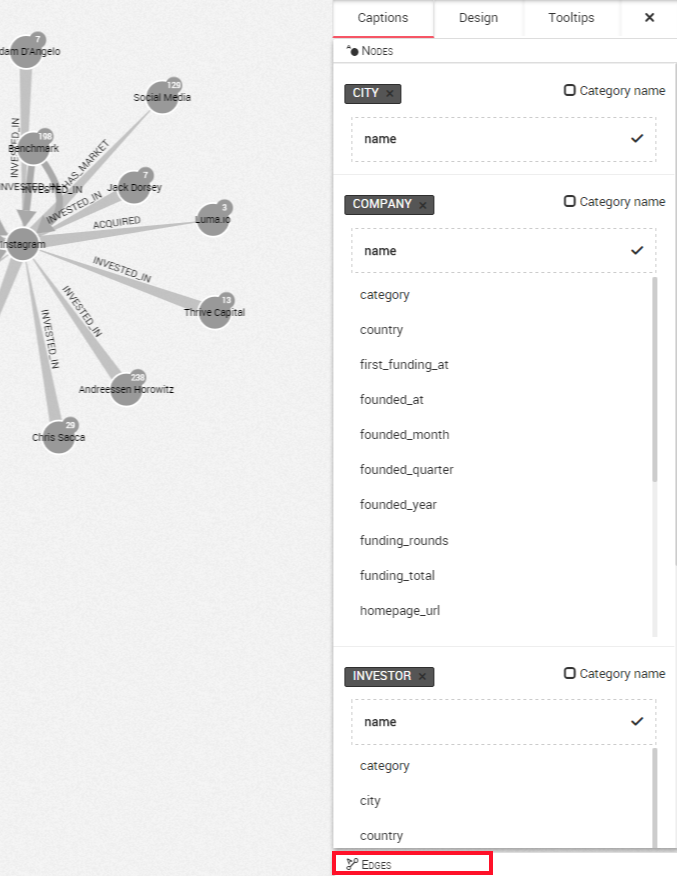
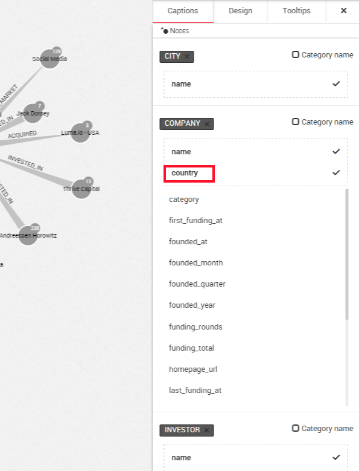
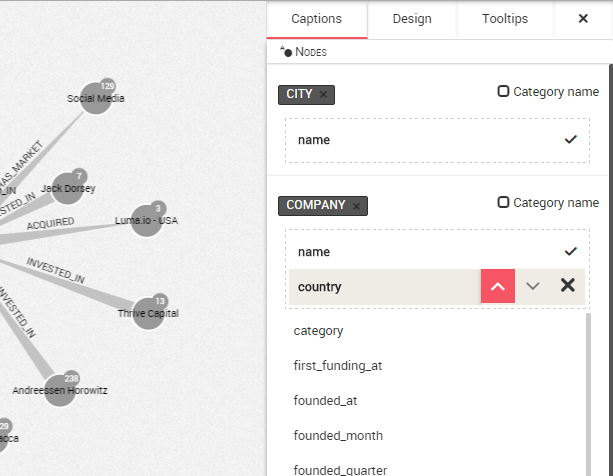

## Personalizar las leyendas

Linkurious Enterprise le permite escoger qué propiedades de sus nodos y relaciones deberían mostrarse en el área de visualización.

En el ejemplo más abajo, solamente los nombres (```names```) de los nodos son mostrados por Linkurious Enterprise. Para ello, necesitamos abrir el panel de diseño (```design panel```) en el lado derecho.
 
En la pestaña de leyendas (```Captions```), podemos ver las diferentes propiedades de los nodos en nuestro grafo. La propiedad ```name``` aparece primero. En la parte inferior de la pantalla es posible seleccionar las relaciones.



Por ejemplo, queremos mostrar el país (```country```) en la visualización. Para hacerlo, hacemos clic en ```country``` y será añadida a la lista de propiedades mostradas en el área rodeada por la línea de puntos.



El texto mostrado junto al nodo cambia. En lugar de  ```Instagram``` ahora tenemos la información ```Instagram - USA```.

La misma estrategia puede ser usada para las relaciones.

> Linkurious Enterprise utilizará las propiedades en el orden en el que aparecen en la lista. Poniendo el cursor en una propiedad, tenemos la posibilidad de cambiar el orden de una propiedad o eliminarla. Si un nodo no tiene una propiedad, Linkurious Enterprise pasará a la siguiente propiedad, etc.

