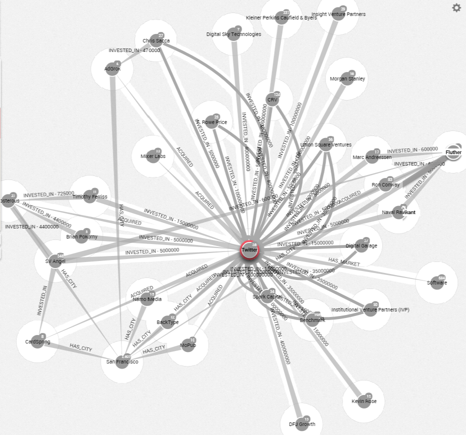
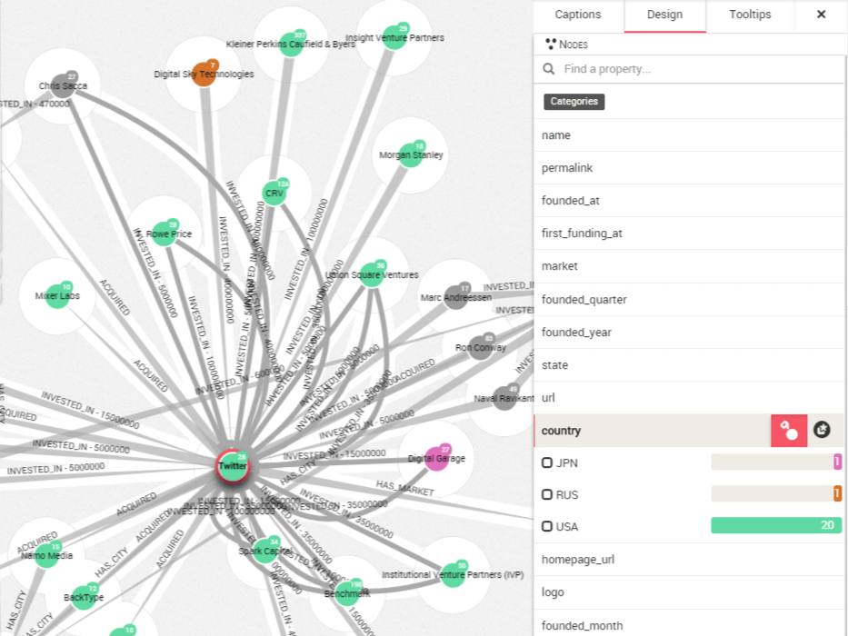
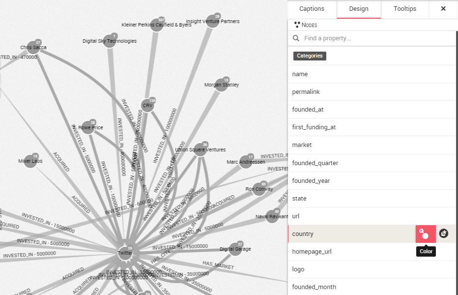

## Colorear los nodos de acuerdo a una propiedad

Si todos los nodos o relaciones tienen el mismo color, es difícil distinguirlos sin mirar sus propiedades individuales. Una buena forma de evitar este problema es elegir un color para los nodos de acuerdo a cierta propiedad.

Por ejemplo, nuestros nodos podrían tener una propiedad ```country``` (país) que nos gustaría resaltar, por tanto Linkurious Enterprise nos permite colorear los nodos de acuerdo a una propiedad en particular, en este caso ```country```.

De esta forma, una start-up francesa y una alemana tendrán colores diferentes. Será más sencillo distinguirlas visualmente.

En la imagen debajo, podemos ver las start-ups e inversores a los que Twitter está conectado. A primera vista no podemos saber de donde proceden.



Primero, abrimos el panel de diseño en la esquina derecha de la pantalla y pulsamos en la pestaña ```Design``` (diseño). Podemos ver todas las propiedades de los nodos. Hacemos clic en el botón ```color``` junto a la propiedad ```country``` para colorear los nodos de acuerdo a esta propiedad.



Vemos:
* los diferentes valores asociados con la propiedad ```country``` (CAN, GBR, JPN, RUS, USA)
* el número de ocurrencias que hay de cada valor (hay 20 nodos con el valor ```USA```)
* qué color es asociado con cada valor (```USA``` es verde)

Tenga en cuenta que los nodos que no tienen la propiedad ```country``` permanecerán grises.

Para colorear los nodos de acuerdo a otra propiedad, primero eliminamos los colores haciendo clic en el mismo botón ```color```:



Después, podemos hacer clic en el botón ```color``` de otra propiedad.
